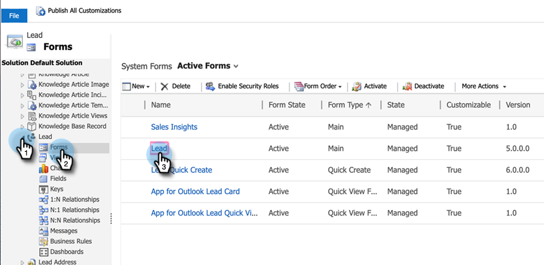
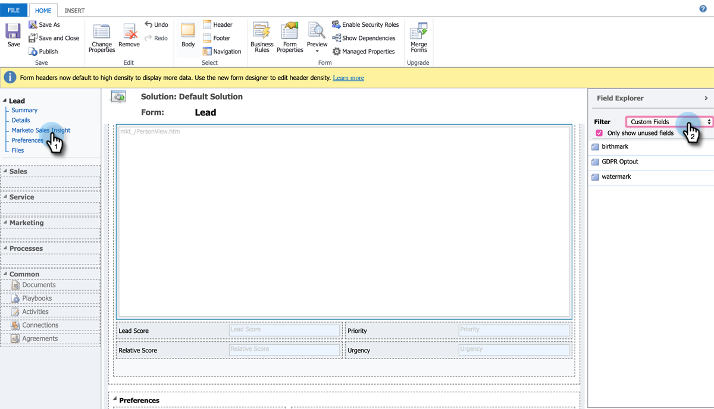

# Configurer les étoiles et les flammes pour les enregistrements des leads/contacts {#setting-up-stars-and-flames-for-lead-contact-records}

Les étoiles et les flammes sur les enregistrements de lead/contact dépendent des champs [!UICONTROL Score du lead], [!UICONTROL Score relatif], [!UICONTROL Urgence] et [!UICONTROL Priorité]. Ces champs sont disponibles par défaut après l’installation et la configuration de la solution MSI. Si vous n&#39;avez pas d&#39;étoiles et de flammes, une configuration/personnalisation antérieure aurait pu entraîner leur suppression. Suivez les étapes ci-dessous pour les ajouter.

1. Dans [!DNL Microsoft Dynamics], cliquez sur le menu déroulant Ventes et sélectionnez **[!UICONTROL Paramètres]**. Cliquez sur **[!UICONTROL Personnalisations]**, puis **[!UICONTROL Personnaliser le système]**.

1. Dans le panneau de gauche, cliquez sur **[!UICONTROL Entités]**.

1. Recherchez et cliquez sur **[!UICONTROL Lead]**, puis sur **[!UICONTROL Forms]** et sélectionnez le formulaire à modifier.

   

1. Cliquez sur **[!UICONTROL Marketo Sales Insight]** dans le panneau de gauche. Dans le panneau de droite, cliquez sur le menu déroulant Filtre et sélectionnez **[!UICONTROL Champs personnalisés]**.

   

1. Faites glisser et déposez les champs suivants : [!UICONTROL Score du lead], [!UICONTROL Score relatif], [!UICONTROL Urgence] et [!UICONTROL Priorité]. Organisez-les de la manière qui vous convient le mieux. Vous pouvez également formater n’importe quel champ en double-cliquant dessus.

1. Lorsque vous avez terminé, cliquez sur **[!UICONTROL Enregistrer et fermer]**.
