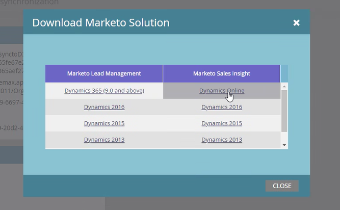

# Mettre à niveau la solution [!DNL Marketo Sales Insight] pour [!DNL Microsoft Dynamics] {#upgrade-the-marketo-sales-insight-solution-for-microsoft-dynamics}

Lorsqu’une nouvelle solution [!DNL Microsoft Dynamics] est publiée pour [!DNL Sales Insight], vous pouvez télécharger la mise à niveau depuis la zone [!UICONTROL Admin] de votre compte .

>[!NOTE]
>
>**Autorisations d’administration requises**

1. Accédez à la zone **[!UICONTROL Admin]**.

   

1. Cliquez sur **&#x200B;**.

   

1. Sélectionnez **[!UICONTROL Télécharger la solution Marketo]**.

   

1. Sélectionnez la solution appropriée pour votre version de [!DNL Microsoft Dynamics].

   

   Génial ! Un fichier zip de la solution sera désormais téléchargé sur votre appareil.

## Exécution de la mise à niveau {#performing-the-upgrade}

1. Importez la dernière version de la solution par rapport à la version existante de votre [!DNL Dynamics CRM] (par exemple, si votre [!DNL Dynamics CRM] dispose de la version 1.4 et que la dernière version est la version 1.5, vous devez importer _plus_ la version 1.4).

2. Le pop-up suivant s’affiche. Sélectionnez **[!UICONTROL Phase de mise à niveau]** et **[!UICONTROL Maintenir les personnalisations]**, puis cliquez sur **[!UICONTROL Importer]**.

