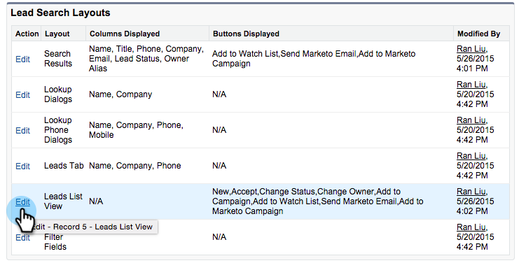

# Ajouter des boutons d’action en bloc à [!DNL Salesforce] Classic{#add-bulk-action-buttons-to-salesforce-classic}

Vous pouvez ajouter des boutons Marketo à vos mises en page [!DNL Salesforce]. Voici un exemple :

1. Cliquez sur **[!UICONTROL Configurer]**. Recherchez « [!UICONTROL disposition de recherche] » et cliquez sur le **[!UICONTROL disposition de recherche]** sous **[!UICONTROL Leads]**.

   

1. Cliquez sur **[!UICONTROL Modifier]** dans la ligne **[!UICONTROL Vue Liste des prospects]**.

   

1. Ajoutez **[!UICONTROL Ajouter à Marketo Campaign]**, **[!UICONTROL Envoyer un e-mail Marketo]** et **[!UICONTROL Ajouter à la liste de contrôle]** les boutons **[!UICONTROL Boutons sélectionnés]** et **[!UICONTROL Enregistrer]**.

   

   >[!TIP]
   >
   >Maintenez la touche Maj enfoncée pour sélectionner les trois boutons en même temps.

1. Répétez ces étapes pour vos contacts (les trois boutons) et comptes (un seul bouton : Ajouter à la liste de surveillance).

   >[!NOTE]
   >
   >Vous ne pouvez pas ajouter de boutons Marketo aux opportunités.
