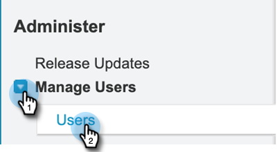
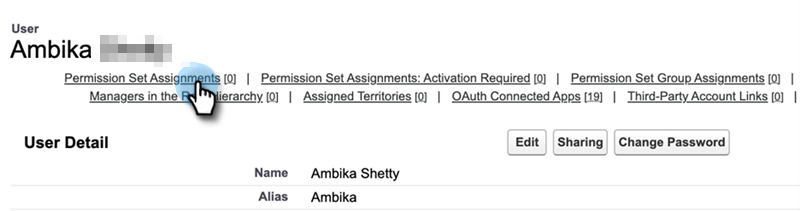
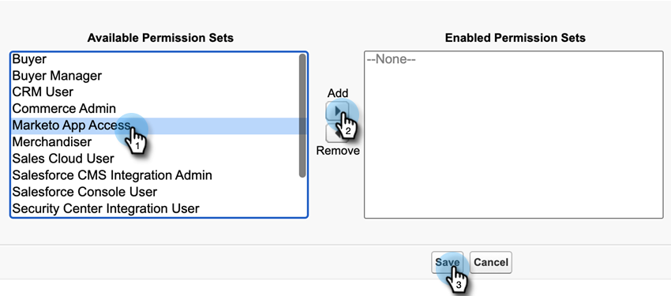

# Ajouter un jeu d’autorisations [!DNL Sales Insight] {#add-sales-insight-permission-set}

Procédez comme suit pour ajouter l’accès aux fonctionnalités [!DNL Sales Insight] dans [!DNL Salesforce]. Applicable à [!DNL Salesforce] Classic et Lighting

>[!PREREQUISITES]
>
>[Mettez à jour votre [!DNL Sales Insight] [!DNL Salesforce] package](/help/marketo/product-docs/marketo-sales-insight/msi-for-salesforce/upgrading/upgrading-your-msi-package.md){target="_blank"} vers la version 1.8000 ou ultérieure pour utiliser cette fonctionnalité.

>[!IMPORTANT]
>
>* Si vous avez précédemment donné un accès [!DNL Sales Insight] à tous les profils et/ou implémenté des [!DNL Sales Insight] pour tous vos utilisateurs, vous devez [supprimer l’accès au niveau du profil](/help/marketo/product-docs/marketo-sales-insight/msi-for-salesforce/configuration/remove-sales-insight-access.md){target="_blank"} pour utiliser ce jeu d’autorisations.
>
>* La licence Salesforce standard est requise pour une fonctionnalité complète de MSI. Les utilisateurs disposant de la licence Salesforce Platform (une classe de licence limitée) peuvent voir des erreurs lors de l’exécution de certaines actions ou de l’accès à certains onglets.

## Vue d’ensemble {#overview}

L’autorisation « Application Marketo » fait partie du package [!DNL Sales Insight] [!DNL Salesforce]. Il permet d’accéder aux objets, classes apex et pages visualforce mentionnés ci-dessous. Ils sont nécessaires pour accéder à toutes les fonctionnalités [!DNL Sales Insight].

**Paramètres de l’objet**

<table>
 <tbody>
 <tr>
   <td>BestBetsCache</td>
   <td>Lecture, Création, Modification, Suppression, Afficher tout, Modifier tout</td>
  </tr>
  <tr>
   <td>Détails de la vue des meilleurs paris</td>
   <td>Lecture, Création, Modification, Suppression, Afficher tout, Modifier tout</td>
  </tr>
  <tr>
   <td>Meilleures vues</td>
   <td>Lecture, Création, Modification, Suppression, Afficher tout, Modifier tout</td>
  </tr>
  <tr>
   <td>EmailActivityCache</td>
   <td>Lecture, Création, Modification, Suppression, Afficher tout, Modifier tout</td>
  </tr>
  <tr>
   <td>GetMethodArgus</td>
   <td>Lecture, Création, Modification, Suppression, Afficher tout, Modifier tout</td>
  </tr>
  <tr>
   <td>GroupedWebActivityCache</td>
   <td>Lecture, Création, Modification, Suppression, Afficher tout, Modifier tout</td>
  </tr>
  <tr>
   <td>CacheMomentsIntéressants</td>
   <td>Lecture, Création, Modification, Suppression, Afficher tout, Modifier tout</td>
  </tr>
  <tr>
   <td>Configuration du [!DNL Sales Insight] Marketo</td>
   <td>Lecture, Création, Modification, Suppression, Afficher tout, Modifier tout</td>
  </tr>
  <tr>
   <td>ScoringCache</td>
   <td>Lecture, Création, Modification, Suppression, Afficher tout, Modifier tout</td>
  </tr>
  <tr>
   <td>Valeurs</td>
   <td>Lecture, Création, Modification, Suppression, Afficher tout, Modifier tout</td>
  </tr>
  <tr>
   <td>CacheActivitéWeb</td>
   <td>Lecture, Création, Modification, Suppression, Afficher tout, Modifier tout</td>
  </tr>
 </tbody>
</table>

* Accès aux classes Apex : 159 classes Apex commençant par « mkto_si »
* Accès à la page Visualforce : 64 pages Visualforce commençant par « mkto_si »
* Définitions des paramètres personnalisés : mkto_si.Marketo Settings &amp; mkto_si.User Preferences

## Ajout d’un jeu d’autorisations d’application Marketo aux utilisateurs {#adding-marketo-app-permission-set-to-users}

1. Connectez-vous à votre compte [!DNL Salesforce].

1. Cliquez sur **[!UICONTROL Configurer]**.

   

1. Sous Administrateur, cliquez pour déployer **[!UICONTROL Gérer les utilisateurs]**, puis **[!UICONTROL Utilisateurs]**.

   

1. Sous Tous les utilisateurs, sélectionnez l’utilisateur auquel vous souhaitez accorder l’accès, puis cliquez sur **[!UICONTROL Affectations de jeux d’autorisations]**.

   

1. Cliquez sur **[!UICONTROL Modifier les affectations]**.

   

1. Sélectionnez **[!UICONTROL Accès à l&#39;application]** parmi les jeux d&#39;autorisations disponibles, puis **[!UICONTROL Ajouter]**. Cliquez sur **[!UICONTROL Enregistrer]**

   

1. Désormais, lorsque vous faites défiler la page Détails de l’utilisateur vers le bas, vous voyez « Accès à l’application Marketo » sous Affectations de jeux d’autorisations.

   

>[!NOTE]
>
>Les utilisateurs qui n’ont pas accès à [!DNL Sales Insight] verront le message suivant : « Vous ne disposez pas des privilèges suffisants pour accéder à cet onglet ».

Vous avez terminé. Vous avez correctement ajouté l’accès à [!DNL Sales Insight]. Répétez les mêmes étapes pour tout autre profil auquel vous souhaitez ajouter un accès.
