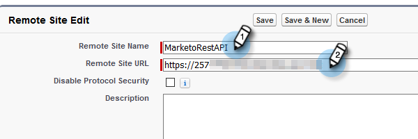

# Configuration pour les clientes et clients existants {#configuration-for-existing-customers}

Veuillez configurer la configuration suivante pour commencer à utiliser le nouveau tableau de bord d’Insights.

>[!PREREQUISITES]
>
>Assurez-vous d’avoir mis à niveau votre package [!DNL Salesforce] vers la dernière version

## Configuration de [!DNL Sales Insight] dans Marketo {#configure-sales-insight-in-marketo}

1. Ouvrez un nouvel onglet dans votre navigateur pour obtenir les informations d’identification [!DNL Marketo Sales Insights] à partir de votre compte Marketo.

1. Accédez à la zone **[!UICONTROL Admin]**.

   

1. Cliquez sur **[!UICONTROL Ventes Insight]**.

   

1. Cliquez sur **[!UICONTROL Afficher]** pour renseigner les informations d’identification de l’API REST.

   

1. Un pop-up de confirmation s’affiche. Cliquez sur **[!UICONTROL OK]**.

## Configuration de [!DNL Sales Insight] dans [!DNL Salesforce] {#configure-sales-insight-in-salesforce}

1. Dans Salesforce, cliquez sur **[!UICONTROL Configuration]**.

   

1. Recherchez et sélectionnez **[!UICONTROL Paramètres du site distant]**.

   

1. Cliquez sur **[!UICONTROL Nouveau site distant]**.

   

1. Saisissez le [!UICONTROL  Nom du site distant ] (par exemple, « MarketoRestAPI ») et l’[!UICONTROL URL du site distant ] (votre URL d’API à partir du panneau Configuration de l’API REST dans Marketo).

   

1. Cliquez sur **[!UICONTROL Enregistrer]**

   

   Vous avez maintenant créé un paramètre de site distant pour l’API REST.

## Accès Sales Insight de Marketo {#access-marketo-sales-insight}

1. Copiez les informations d’identification depuis le panneau API Rest de [!DNL Marketo’s Sales Insight] page Admin . Collez-les dans la section API Rest de la page Configuration [!DNL Sales Insight] de Salesforce.

1. Saisissez la [!UICONTROL  Clé secrète API ].

   
