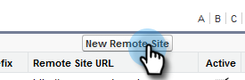

# Configuration pour les clients existants {#configuration-for-existing-customers}

Configurez la configuration suivante afin de commencer à utiliser le nouveau tableau de bord des statistiques.

>[!PREREQUISITES]
>
>Vérifiez que vous avez mis à niveau votre package Salesforce vers la dernière version.

## Configuration de Sales Insight dans Marketo {#configure-sales-insight-in-marketo}

1. Ouvrez un nouvel onglet dans votre navigateur pour obtenir les informations d’identification Marketo Sales Insights de votre compte Marketo.

1. Accédez à la zone **Admin**.

   

1. Cliquez sur **Sales Insight**.

   

1. Cliquez sur **Afficher** pour renseigner les informations d’identification de l’API REST.

   

1. Vous verrez une fenêtre contextuelle de confirmation. Cliquez sur **OK**.

## Configuration de Sales Insight dans Salesforce {#configure-sales-insight-in-salesforce}

1. Dans Salesforce, cliquez sur **Setup**.

   

1. Recherchez et sélectionnez **Paramètres du site distant**.

   

1. Cliquez sur **Nouveau site distant**.

   

1. Saisissez le nom du site distant (il peut s’agir de &quot;MarketoRestAPI&quot;) et l’URL du site distant (l’URL de votre API depuis le panneau Configuration de l’API REST dans Marketo).

   

1. Cliquez sur **Enregistrer**.

   

   Vous avez maintenant créé un paramètre de site distant pour l’API REST.

## Accès Sales Insight de Marketo {#access-marketo-sales-insight}

1. Copiez les informations d’identification du panneau API REST dans la page d’administration des statistiques sur les ventes de Marketo. Collez-les dans la section API REST de la page de configuration des statistiques sur les ventes de Salesforce.

1. Saisissez la clé secrète de l’API.

   
