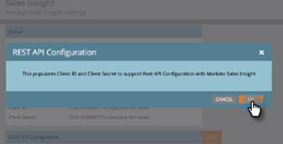
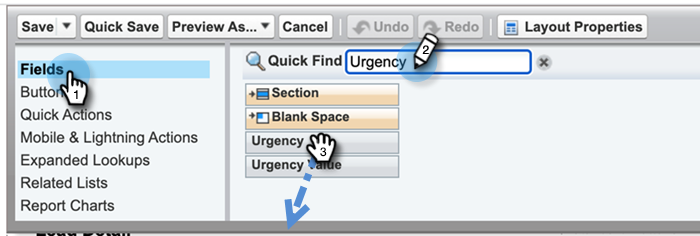

# Configurer [!DNL Marketo Sales Insight] dans [!DNL Salesforce] Enterprise/Unlimited {#configure-marketo-sales-insight-in-salesforce-enterprise-unlimited}

Configurez Marketo Sales Insight dans les éditions Entreprise/Illimité de Salesforce en procédant comme suit.

>[!PREREQUISITES]
>
>[Installer [!DNL Marketo Sales Insight] Package dans [!DNL Salesforce] AppExchange](/help/marketo/product-docs/marketo-sales-insight/msi-for-salesforce/installation/install-marketo-sales-insight-package-in-salesforce-appexchange.md)

>[!NOTE]
>
>**Des autorisations d’administrateur sont requises.**

## Configuration de Sales Insight dans Marketo Engage {#configure-sales-insight-in-marketo}

1. Pour obtenir vos informations d’identification Marketo Sales Insight dans Marketo Engage, accédez à la zone **[!UICONTROL Admin]** et sélectionnez **[!UICONTROL Sales Insight]**.

   

1. Cliquez sur **[!UICONTROL Modifier la configuration de l’API]**.

   

1. Saisissez la clé secrète API de votre choix, puis cliquez sur **[!UICONTROL Enregistrer]**. N’utilisez PAS d’esperluette (`&`) dans votre clé secrète API.

   

   >[!NOTE]
   >
   >Votre clé secrète API est semblable à un mot de passe pour votre organisation et doit être sécurisée.

1. Pour renseigner les informations d’identification, cliquez sur **[!UICONTROL Afficher]** dans le panneau _[!UICONTROL Configuration de l’API REST]_.

   

1. Lorsqu’une boîte de dialogue de confirmation s’affiche, cliquez sur **[!UICONTROL OK]**.

   

   >[!TIP]
   >
   >Gardez cette fenêtre ouverte. Vous aurez besoin de ces informations ultérieurement pour la configuration de Salesforce.

## Renseigner les nouvelles informations d’identification de l’API REST {#populate-new-rest-api-credentials}

1. Lorsque vous renseignez les informations d’identification de l’API Rest pour la première fois, le bouton _Affichage_ devient _Modifier_. Cliquez sur le bouton **Modifier**.

   

1. Un message s’affiche pour confirmer que vous souhaitez régénérer les informations d’identification de l’API. Cliquez sur **Enregistrer**

   {width="800" zoomable="yes"}

1. Une fois les nouvelles informations d’identification renseignées, mettez-les à jour dans l’onglet _Configuration Marketo_ de votre instance Salesforce.

   

## Configuration de [!DNL Sales Insight] dans [!DNL Salesforce] {#configure-sales-insight-in-salesforce}

1. Dans Salesforce, cliquez sur **[!UICONTROL Configuration]**.

   

1. Recherchez « site distant » et sélectionnez **[!UICONTROL Paramètres du site distant]**.

   

1. Cliquez sur **[!UICONTROL Nouveau site distant]**.

   

1. Saisissez le nom du site distant (il peut s’agir d’un nom similaire à `MarketoSoapAPI`). Saisissez l’URL du site distant, qui est votre URL d’hôte Marketo à partir du panneau _[!UICONTROL Configuration de l’API Soap]_ dans Marketo Engage. Cliquez sur **[!UICONTROL Enregistrer]**. Vous avez maintenant créé des paramètres de site distant pour l’API Soap.

   

1. Cliquez de nouveau sur **[!UICONTROL Nouveau site distant]**.

   

1. Saisissez le nom du site distant (il peut s’agir d’un nom similaire à `MarketoAPI`). Saisissez l’URL du site distant, qui est votre URL d’API à partir du panneau _[!UICONTROL Configuration de l’API REST]_ dans Marketo Engage. Cliquez sur **[!UICONTROL Enregistrer]**. Vous avez maintenant créé les paramètres du site distant pour l’API REST.

   >[!NOTE]
   >
   >_Vous_ choisir votre **[!UICONTROL Nom du site distant]** (`MarketoAPI` est utilisé ici). L’**[!UICONTROL URL du site distant]** se trouve dans le champ Hôte Marketo de la boîte de dialogue Modifier la configuration de l’API à l’étape 3 de la section « Configurer l’Insight des ventes dans Marketo ».

## Octroyer aux utilisateurs de Sales Insight l’accès aux objets Salesforce standard {#grant-sales-insight-users-profile-access}

En raison des améliorations apportées à la sécurité de Salesforce, les packages AppExchange ne peuvent plus accorder d’autorisation aux objets standard. En outre, l’accès doit être accordé aux objets Salesforce appropriés à partir du profil de l’utilisateur Salesforce. Pour accorder les autorisations requises, procédez comme suit.

1. Cliquez sur **[!UICONTROL Configurer]**.

1. Recherchez « Profils » dans la recherche rapide.

1. Cliquez sur **[!UICONTROL Modifier]** en regard du profil utilisé par vos utilisateurs Salesforce.

1. Dans la section _[!UICONTROL Autorisation d’objet standard]_, activez l’accès **[!UICONTROL Lecture]** pour les objets suivants : [!UICONTROL Lead], [!UICONTROL Contact], [!UICONTROL Compte] et [!UICONTROL Opportunité].

1. Cliquez sur **[!UICONTROL Enregistrer]**

## Personnaliser les mises en page {#customize-page-layouts}

1. Cliquez sur **[!UICONTROL Configurer]**.

   

1. Recherchez « mise en page » et sélectionnez le **[!UICONTROL Mise en page]** sous **[!UICONTROL Prospects]**.

   

1. Cliquez sur **[!UICONTROL Pages Visualforce]** sur la gauche. Faites glisser **[!UICONTROL Section]** vers la disposition sous la section _[!UICONTROL Liens personnalisés]_.

   

1. Saisissez « Marketo Sales Insight » comme **[!UICONTROL Nom de la section]**, sélectionnez **[!UICONTROL 1-Column]**, puis cliquez sur **[!UICONTROL OK]**.

   

1. Glissez-déposez **[!UICONTROL Lead]** dans la nouvelle section.

   

   >[!TIP]
   >
   >Le nom de cette zone change en fonction du type d’objet. Par exemple, si vous modifiez la mise en page des contacts, elle affiche Contact.

1. Double-cliquez sur le bloc **[!UICONTROL Lead]** que vous venez d’ajouter.

   

1. Modifiez la hauteur en **450** pixels et cliquez sur **[!UICONTROL OK]**.

   

   >[!NOTE]
   >
   >Cochez la case **[!UICONTROL Afficher les barres de défilement]** si vous avez besoin d’accéder aux activités de défilement.

   >[!TIP]
   >
   >La hauteur recommandée pour les objets Comptes et Opportunités est de 410 pixels.

1. Cliquez sur **[!UICONTROL Champs]** à gauche. Recherchez ensuite le libellé **[!UICONTROL Urgence]** et faites-le glisser vers la disposition **[!UICONTROL Marketo Sales Insight]**.

   

1. Répétez également l’étape ci-dessus pour ces champs.

   * Dernier moment significatif
   * Date dernier moment significatif
   * Description dernier moment significatif
   * Source dernier moment significatif
   * Type dernier moment significatif
   * Dernière activité par ventes
   * Dernier engagement par les ventes
   * ID de contact MSI
   * Évaluation relative
   * Valeur d&#39;évaluation relative
   * Urgence
   * Valeur d&#39;urgence
   * Afficher dans Marketo

1. Cliquez sur **[!UICONTROL Enregistrer]** lorsque vous avez terminé.

   

1. Répétez les étapes 5 à 7 pour ajouter des sections de page Visualforce et des champs Insight de ventes pour **[!UICONTROL Contact]**, **[!UICONTROL Compte]** et **[!UICONTROL Opportunité]**.

1. Répétez les étapes 8 à 10 pour ajouter ces champs Sales Insight pour **[!UICONTROL Contact]**. Veillez à enregistrer les modifications.

   * Dernier moment significatif
   * Date du dernier moment significatif
   * [!UICONTROL Desc Dernier moment intéressant]
   * [!UICONTROL Source du dernier moment intéressant]
   * [!UICONTROL Type de dernier moment intéressant]
   * [!UICONTROL Dernière activité Marketo par ventes]
   * [!UICONTROL Dernier engagement Marketo par les ventes]
   * [!UICONTROL Score du lead MKTO]
   * [!UICONTROL &#x200B; Score relatif &#x200B;]
   * [!UICONTROL &#x200B; Valeur de score relative &#x200B;]
   * [!UICONTROL Ventes Insight] - Ouvre la page de liste complète des contacts
   * [!UICONTROL Urgence]
   * [!UICONTROL Valeur d’urgence]

## Mapper les champs de personne personnalisés {#map-custom-person-fields}

Les champs Personne de Marketo doivent être mappés aux champs Contact de Salesforce pour garantir le bon fonctionnement de la conversion. Pour les mapper, procédez comme suit.

1. Cliquez sur **[!UICONTROL Configurer]**.

   

1. Recherchez « fields » dans la barre de recherche et cliquez sur **[!UICONTROL Fields]** sous **[!UICONTROL Leads]**.

   

1. Cliquez sur **[!UICONTROL Mapper les champs de lead]**.

   

1. Cliquez sur la liste déroulante à droite pour **[!UICONTROL Engagement]**.

   

1. Sélectionnez **[!UICONTROL Contact.Engagement]** dans la liste.

   

1. Répétez et mappez également ces champs.

   | Champ personnalisé de personne Marketo | Champ personnalisé du contact Salesforce |
   |--- |--- |
   | `Engagement` | `Contact.Engagement` |
   | `Relative Score Value` | `Contact.Relative Score Value` |
   | `Urgency Value` | `Contact.Urgency Value` |
   | `Last Interesting Moment Date` | `Contact.Last Interesting Moment Date` |
   | `Last Interesting Moment Desc` | `Contact.Last Interesting Moment Desc` |
   | `Last Interesting Moment Source` | `Contact.Last Interesting Moment Source` |
   | `Last Interesting Moment Type` | `Contact.Last Interesting Moment Type` |

1. Cliquez sur **[!UICONTROL Enregistrer]** lorsque vous avez terminé.

## Onglet Configuration de Marketo Sales Insight {#marketo-sales-insight-configuration-tab}

1. Dans Salesforce, cliquez sur le signe **+** à l’extrémité de la barre d’onglets, puis cliquez sur **[!UICONTROL Configuration Insight des ventes Marketo]**.

1. Copiez les informations d’identification du panneau API Soap dans la page d’administration Marketo Sales Insight [&#128279;](/help/marketo/product-docs/marketo-sales-insight/msi-for-salesforce/configuration/configure-marketo-sales-insight-in-salesforce-professional-edition.md#set-up-marketo-sales-insight){target="_blank"} et collez-les dans la section API Soap de la page Configuration de [!DNL Salesforce] [!DNL Sales Insight].

1. Copiez les informations d’identification à partir du panneau API Rest dans la page d’administration Marketo Sales Insight [&#128279;](/help/marketo/product-docs/marketo-sales-insight/msi-for-salesforce/configuration/configure-marketo-sales-insight-in-salesforce-professional-edition.md#set-up-marketo-sales-insight){target="_blank"} et collez-les dans la section API Rest de la page Configuration de [!DNL Salesforce] [!DNL Sales Insight].

   

Vous devriez être en mesure de voir les champs Marketo Sales Insight pour les leads, les contacts, les comptes et les opportunités.

>[!NOTE]
>
>Si le test des diagnostics échoue, l’ajout [ champs supplémentaires à la mise en page ](https://nation.marketo.com:443/t5/knowledgebase/how-to-repair-marketo-sales-insight-setup-configuration-problems/ta-p/248218){target="_blank"} peut résoudre le problème.

>[!NOTE]
>
>Pour les comptes, Sales Insight inclut tous les e-mails, mais uniquement les moments intéressants les plus récents, l’activité web et les changements de score.

>[!MORELIKETHIS]
>
>* [Priorité, urgence, score relatif et meilleurs résultats](/help/marketo/product-docs/marketo-sales-insight/msi-for-salesforce/features/stars-and-flames/priority-urgency-relative-score-and-best-bets.md)
>* [Ajouter l’onglet Marketo à  [!DNL Salesforce]](/help/marketo/product-docs/marketo-sales-insight/msi-for-salesforce/configuration/add-marketo-tab-to-salesforce.md)
>* [Ajouter un accès Sales Insight aux profils](/help/marketo/product-docs/marketo-sales-insight/msi-for-salesforce/configuration/add-sales-insight-access-to-profiles.md){target="_blank"}
