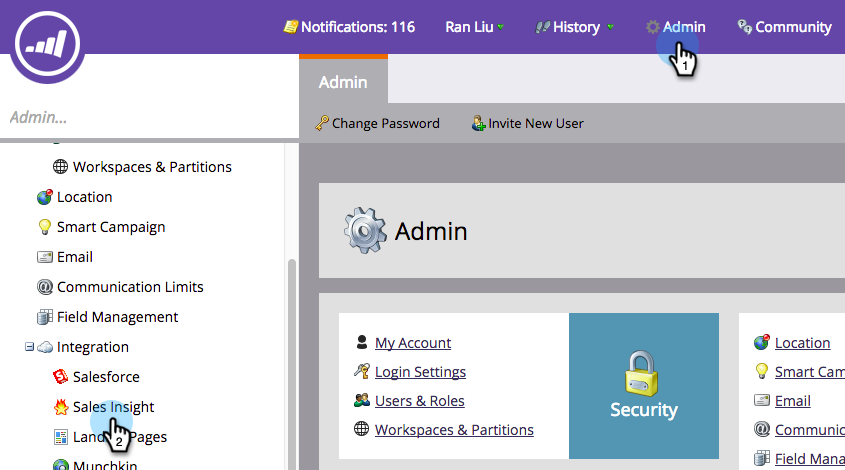

# Configuration de Marketo Sales Insight dans Salesforce Enterprise/Unlimited {#configure-marketo-sales-insight-in-salesforce-enterprise-unlimited}

Voici les étapes à suivre pour configurer Marketo Sales Insight dans Salesforce Enterprise/Unlimited Editions. Commençons.

>[!PREREQUISITES]
>
>* [Installation du package Marketo Sales Insight dans l’AppExchange Salesforce](/help/marketo/product-docs/marketo-sales-insight/msi-for-salesforce/installation/install-marketo-sales-insight-package-in-salesforce-appexchange.md)

>[!NOTE]
**Autorisations d’administrateur requises**

## Configuration de Sales Insight dans Marketo {#configure-sales-insight-in-marketo}

1. Ouvrez une nouvelle fenêtre de navigateur pour obtenir les informations d’identification Marketo Sales Insight de votre compte Marketo.

1. Dans la zone Admin, sélectionnez **Sales Insight**.

   

1. Cliquez sur **Modifier la configuration de l’API**.

   

1. Saisissez une clé secrète API de votre choix, puis cliquez sur **Enregistrer**. N’utilisez PAS d’esperluette (&amp;) dans votre clé secrète API.

   

   >[!NOTE]
   Votre clé secrète API est semblable à un mot de passe pour votre organisation et doit être sécurisée.

1. Cliquez sur **Afficher** dans le panneau Configuration de l’API REST pour renseigner les informations d’identification.

   

1. Une fenêtre contextuelle de confirmation s’affiche. Cliquez sur **OK**.

   

## Configuration de Sales Insight dans Salesforce {#configure-sales-insight-in-salesforce}

1. Dans Salesforce, cliquez sur **Configuration**.

   

1. Recherchez &quot;site distant&quot; et sélectionnez **Paramètres du site distant**.

   

1. Cliquez sur **Nouveau site distant**.

   

1. Saisissez le nom du site distant (il peut s’agir de &quot;MarketoSoapAPI&quot;). Saisissez l’URL du site distant, qui est votre URL d’hôte Marketo à partir du panneau Configuration de l’API Soap de Marketo. Cliquez sur **Enregistrer**. Vous avez maintenant créé des paramètres de site distant pour l’API Soap.

   

1. Cliquez à nouveau sur **Nouveau site distant**.

   

1. Saisissez le nom du site distant (il peut s’agir de &quot;MarketoRestAPI&quot;). Saisissez l’URL du site distant, qui correspond à l’URL de votre API dans le panneau Configuration de l’API REST de Marketo. Cliquez sur **Enregistrer**. Vous avez maintenant créé des paramètres de site distant pour l’API REST.

## Configuration de Marketo Sales Insight {#set-up-marketo-sales-insight}

1. Connectez-vous à votre instance Marketo et cliquez sur **Admin**.

   

1. Cliquez sur **Sales Insight**.

   

1. Cliquez sur **Modifier la configuration de l’API**.

   

1. Saisissez une **clé secrète API** et cliquez sur **Enregistrer**.

   >[!CAUTION]
   N’utilisez pas d’esperluette (&amp;) dans votre clé secrète API.

   

   >[!TIP]
   Gardez cette fenêtre ouverte. Vous aurez besoin de ces informations plus tard dans Salesforce.

1. Revenez à Salesforce, cliquez sur **Configuration**.

   

1. Recherchez &quot;site distant&quot; et cliquez sur **Paramètres du site distant** sous **Contrôles de sécurité**.

   

1. Cliquez sur **Nouveau site distant**.

   

1. Saisissez **Nom du site distant** et **URL du site distant**, puis cliquez sur **Enregistrer**.

   

   >[!NOTE]
   Vous choisissez votre **nom du site distant** (MarketoAPI est utilisé ici). La **URL du site distant** se trouve dans le champ Hôte Marketo de la boîte de dialogue Modifier la configuration de l’API de l’étape 4.

## Personnalisation des mises en page {#customize-page-layouts}

1. Cliquez sur **Configuration**.

   

1. Recherchez &quot;mise en page&quot; et sélectionnez **Mise en page** sous **Pistes**.

   

1. Cliquez sur **Pages Visualforce** à gauche. Faites glisser **Section** vers la disposition sous la section Liens personnalisés .

   

1. Saisissez &quot;Marketo Sales Insight&quot; comme **Nom de la section**. Sélectionnez **1-Column** et cliquez sur **OK**.

   

1. Faites glisser **Lead** dans la nouvelle section.

   

   >[!TIP]
   Le nom de cette zone change en fonction du type d’objet. Par exemple, si vous modifiez la mise en page des contacts, le message Contact est affiché.

1. Double-cliquez sur le bloc **Lead** que vous venez d’ajouter.

   

1. Editez la hauteur à **450** pixels et cliquez sur **OK**.

   

   >[!TIP]
   Nous recommandons une hauteur de 410 pixels pour les objets Comptes et opportunités .

1. Cliquez sur **Champs** à gauche. Recherchez ensuite le libellé **Engagement** et faites-le glisser dans la disposition **Marketo Sales Insight**.

   

1. Répétez également l’étape ci-dessus pour ces champs.

   <table> 
    <tbody> 
     <tr> 
      <td colspan="1">Engagement</td> 
     </tr> 
     <tr> 
      <td colspan="1" rowspan="1">
Valeur d'évaluation relative
</td> 
     </tr> 
     <tr> 
      <td colspan="1" rowspan="1">
Valeur d'urgence
</td> 
     </tr> 
     <tr> 
      <td colspan="1" rowspan="1">
Date dernier moment significatif
</td> 
     </tr> 
     <tr> 
      <td colspan="1" rowspan="1">
Description dernier moment significatif
</td> 
     </tr> 
     <tr> 
      <td colspan="1" rowspan="1">
Source dernier moment significatif
</td> 
     </tr> 
     <tr> 
      <td colspan="1" rowspan="1">
Type dernier moment significatif
</td> 
     </tr> 
    </tbody> 
   </table>

1. Cliquez sur **Enregistrer** lorsque vous avez terminé.

   

1. Répétez cette procédure pour ajouter des sections de page Visualforce et des champs de statistiques sur les ventes pour **Contact**, **Compte** et **Opportunité**.

1. Répétez les étapes 5 à 7 pour ajouter des sections de page Visualforce pour Contact, Compte et Opportunité. Répétez ensuite les étapes 8 à 10 pour ajouter les champs de statistiques sur les ventes pour **Contact**. Veillez à enregistrer après toute modification.

## Faire correspondre les champs de personne personnalisés {#map-custom-person-fields}

Les champs de personne Marketo doivent être mappés aux champs de contact Salesforce pour garantir le bon fonctionnement de la conversion. Voici comment.

1. Cliquez sur **Configuration**.

   

1. Recherchez &quot;fields&quot; dans la barre de recherche et cliquez sur **Champs** sous **Pistes**.

   

1. Cliquez sur **Faire correspondre les champs de piste**.

   

1. Cliquez sur la liste déroulante à droite de **Engagement**.

   

1. Sélectionnez **Contact.Engagement** dans la liste.

   

1. Répétez et mappez également ces champs.

   <table> 
    <tbody> 
     <tr> 
      <th colspan="1" rowspan="1">Champ personnalisé de personne Marketo</th> 
      <th colspan="1" rowspan="1">Champ personnalisé Contact Salesforce</th> 
     </tr> 
     <tr> 
      <td colspan="1" rowspan="1">
Engagement
</td> 
      <td colspan="1" rowspan="1">
Contact.Engagement
</td> 
     </tr> 
     <tr> 
      <td colspan="1" rowspan="1">
Valeur d'évaluation relative
</td> 
      <td colspan="1" rowspan="1">
Contact.Valeur de score relative
</td> 
     </tr> 
     <tr> 
      <td colspan="1" rowspan="1">
Valeur d'urgence
</td> 
      <td colspan="1" rowspan="1">
Valeur Contact.Urgency
</td> 
     </tr> 
     <tr> 
      <td colspan="1" rowspan="1">
Date dernier moment significatif
</td> 
      <td colspan="1" rowspan="1">
Contact.Last intéressant Moment Date
</td> 
     </tr> 
     <tr> 
      <td colspan="1" rowspan="1">
Description dernier moment significatif
</td> 
      <td colspan="1" rowspan="1">
Contact.Last intéressant Moment Desc
</td> 
     </tr> 
     <tr> 
      <td colspan="1" rowspan="1">
Source dernier moment significatif
</td> 
      <td colspan="1" rowspan="1">
Contact.Last intéressant Moment Source
</td> 
     </tr> 
     <tr> 
      <td colspan="1" rowspan="1">
Type dernier moment significatif
</td> 
      <td colspan="1" rowspan="1">
Contact.Last intéressant Moment Type
</td> 
     </tr> 
    </tbody> 
   </table>

1. Cliquez sur **Enregistrer** lorsque vous avez terminé.

## Configuration de Marketo Sales Insight {#marketo-sales-insight-config}

1. Cliquez sur **+**, puis sélectionnez **Marketo Sales Insight Config**.

   

1. Cochez **Activer l’API Marketo**. Renseignez ensuite les [informations de configuration de l’API dans Marketo Admin](#set-up-marketo-sales-insight). Cliquez sur **Enregistrer les modifications** lorsque vous avez terminé.

   

   >[!NOTE]
   Si le test de diagnostic a échoué, vous devrez peut-être [ajouter d’autres champs à la mise en page](https://nation.marketo.com/docs/DOC-1115).

Et voilà ! Vous devriez être en mesure d’afficher les champs Marketo Sales Insight pour les Leads, les contacts, les comptes et les opportunités.

>[!NOTE]
Pour les comptes, Sales Insight inclura tous les emails, mais uniquement les derniers moments intéressants, l’activité web et les changements de score.

## Accès Sales Insight de Marketo {#access-marketo-sales-insight}

1. Dans Salesforce, cliquez sur **+** à la fin de la barre d’onglets et cliquez sur **Marketo Sales Insight Config**.

1. Cochez la case **Activer l’API Marketo** .

1. Copiez les informations d’identification à partir du panneau API Soap de la page d’administration des statistiques sur les ventes de Marketo et collez-les dans la section API Soap de la page de configuration des statistiques sur les ventes de Salesforce.

1. Copiez les informations d’identification du panneau API REST dans la page d’administration des statistiques sur les ventes de Marketo et collez-les dans la section API REST de la page de configuration des statistiques sur les ventes de Salesforce.

   

>[!MORELIKETHIS]
* [Priorité, urgence, note relative et meilleurs paris](/help/marketo/product-docs/marketo-sales-insight/msi-for-salesforce/features/stars-and-flames/priority-urgency-relative-score-and-best-bets.md)
* [Ajout de l’onglet Statistiques sur les ventes Marketo et de boutons à Salesforce](/help/marketo/product-docs/marketo-sales-insight/msi-for-salesforce/features/bulk-actions/add-marketo-sales-insight-tab-and-buttons-to-salesforce.md)
* [Configuration de Sales Insight pour votre équipe](/help/marketo/product-docs/marketo-sales-insight/msi-for-salesforce/configuration/setting-up-sales-insight-for-your-team.md)

