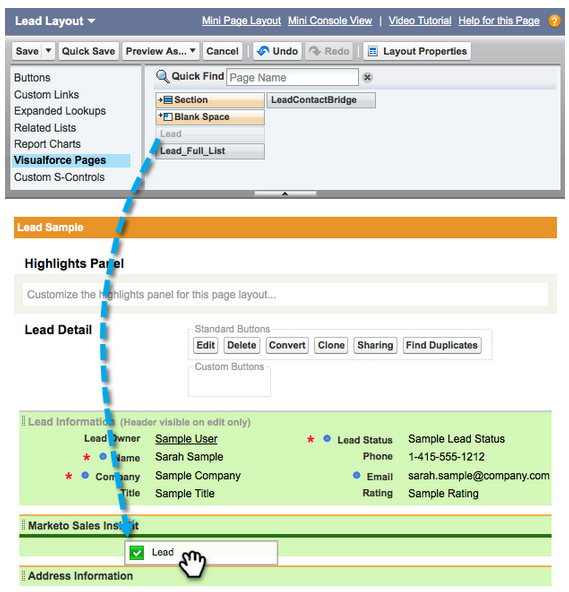
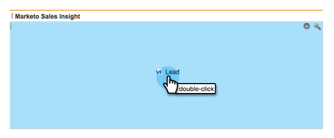

# Configuration de Marketo Sales Insight dans Salesforce Professional Edition {#configure-marketo-sales-insight-in-salesforce-professional-edition}

Vous trouverez ci-dessous les étapes à suivre pour configurer Marketo Sales Insight dans Salesforce Professional Edition. Commençons.

>[!NOTE]
>
>**Conditions préalables**
>
>[Installer Marketo dans votre Salesforce Professional Edition](http://docs.marketo.com/display/docs/professional+edition)
>
>[Installation du package Marketing Cloud Sales Insight dans l’AppExchange Salesforce](../../../../product-docs/marketo-sales-insight/msi-for-salesforce/installation/install-marketo-sales-insight-package-in-salesforce-appexchange.md)

>[!NOTE]
>
>**Autorisations d’administrateur requises**

## Configurer Sales Insight dans Marketo {#configure-sales-insight-in-marketo}

1. Ouvrez une nouvelle fenêtre de navigateur pour obtenir les informations d’identification de Marketing Cloud Sales Insight à partir de votre compte Marketo.
1. Accédez à la zone Admin et sélectionnez **Sales Insight**.

   

1. Cliquez sur **Modifier la configuration** de l’API.

   

1. Saisissez une clé secrète API de votre choix, puis cliquez sur **Enregistrer**. N’utilisez PAS d’esperluette (&amp;) dans votre clé secrète API.

   

   >[!NOTE]
   >
   >Votre clé secrète d&#39;API est un mot de passe pour votre entreprise et doit être sécurisée.

1. Cliquez sur **Vue** dans le panneau Configuration de l’API REST pour renseigner les informations d’identification.

   

1. Une fenêtre contextuelle de confirmation s’affiche. Cliquez sur **OK**.

   

## Configurer Sales Insight dans Salesforce {#configure-sales-insight-in-salesforce}

1. Dans Salesforce, cliquez sur **Configuration**.

   

1. Recherchez &quot;site distant&quot; et sélectionnez Paramètres **du site** distant.

   

1. Cliquez sur **Nouveau site** distant.

   

1. Saisissez le nom du site distant (il peut s’agir de &quot;MarketoSoapAPI&quot;). Saisissez l’URL du site distant, qui correspond à l’URL de l’hôte de marketing depuis le panneau Configuration de l’API Soap de Marketo. Cliquez sur **Enregistrer**. Vous avez maintenant créé des paramètres de site distant pour l’API Soap.

   

1. Cliquez à nouveau sur **Nouveau site** distant.

   

1. Saisissez le nom du site distant (il peut s’agir de &quot;MarketoRestAPI&quot;). Saisissez l’URL du site distant, qui correspond à l’URL de votre API depuis le panneau de configuration de l’API REST de Marketo. Cliquez sur **Enregistrer**. Vous avez maintenant créé des paramètres de site distant pour l’API REST.

## Configurer Marketing Cloud Sales Insight {#set-up-marketo-sales-insight}

1. Connectez-vous à votre instance de marketing et cliquez sur **Admin**.

   

1. Cliquez sur** Sales Insight**.

   

1. Cliquez sur **Modifier la configuration** de l’API.

   

1. Saisissez une clé **secrète** API et cliquez sur **Enregistrer**.

   >[!CAUTION]
   >
   >N’utilisez pas d’esperluette (&amp;) dans votre clé secrète API.

   

   >[!TIP]
   >
   >Garde cette fenêtre ouverte. Vous aurez besoin de cette information plus tard dans Salesforce.

1. Revenez à Salesforce, cliquez sur **Configuration**.

   

1. Recherchez &quot;site distant&quot; et cliquez sur Paramètres **du site** distant sous Contrôles **de** sécurité.

   

1. Cliquez sur **Nouveau site** distant.

   

1. Saisissez le nom **du site** distant et l’URL **du site** distant, puis cliquez sur **Enregistrer**.

   

   >[!NOTE]
   >
   >Vous choisissez votre nom **de site** distant (l’API de marketing est utilisée ici). L’URL **du site** distant se trouve dans le champ Hôte marketing de la boîte de dialogue Modifier la configuration de l’API de l’étape 4.

## Personnalisation des mises en page {#customize-page-layouts}

1. Cliquez sur **Configuration**.

   

1. Recherchez &quot;mise en page&quot; et sélectionnez la **mise en page** sous **Pistes**.

   

1. Cliquez sur **Pages Visualforce **à gauche. Faites glisser **Section** vers la mise en page sous la section Liens personnalisés.

   

1. Saisissez &quot;Insight commercial du marketing&quot; comme nom **de la** section. Sélectionnez **1 colonne** et cliquez sur **OK**.

   

1. Faites glisser **Piste** dans la nouvelle section.

   

   >[!TIP]
   >
   >Le nom de cette zone change en fonction du type d’objet. Par exemple, si vous modifiez la mise en page des contacts, il indique Contact.

1. Cliquez sur le doublon sur le bloc **de piste** que vous venez d&#39;ajouter.

   

1. Modifiez la hauteur à **450** pixels et cliquez sur **OK**.

   

   >[!TIP]
   >
   >Nous vous recommandons une hauteur de 410 pixels pour les objets Comptes et Opportunités.

1. Cliquez sur **Champs **à gauche. Ensuite, recherchez et faites glisser l’étiquette **Engagement** dans la mise en page **Marketo Sales Insight** .

   

1. Répétez également l’étape ci-dessus pour ces champs.

<table> 
 <tbody> 
  <tr> 
   <td colspan="1">Engagement</td> 
  </tr> 
  <tr> 
   <td colspan="1" rowspan="1">
Valeur de score relative
</td> 
  </tr> 
  <tr> 
   <td colspan="1" rowspan="1">
Valeur d’urgence
</td> 
  </tr> 
  <tr> 
   <td colspan="1" rowspan="1">
Date du dernier moment intéressant
</td> 
  </tr> 
  <tr> 
   <td colspan="1" rowspan="1">
Dernier moment intéressant Desc
</td> 
  </tr> 
  <tr> 
   <td colspan="1" rowspan="1">
Dernière source intéressante
</td> 
  </tr> 
  <tr> 
   <td colspan="1" rowspan="1">
Dernier type de moment intéressant
</td> 
  </tr> 
 </tbody> 
</table>

1. Lorsque vous avez terminé, cliquez sur **Enregistrer** .

   

1. Répétez ce processus pour ajouter des sections de page Visualforce et des champs Sales Insight pour **Contact**, **Compte** et **Opportunité**.
1. Répétez les étapes 5 à 7 pour ajouter des sections de page Visualforce pour Contact, Compte et Opportunité. Répétez ensuite les étapes 8 à 10 pour ajouter les champs Sales Insight pour **Contact**. Veillez à enregistrer après toute modification.

## Faire correspondre les champs d’une personne personnalisée {#map-custom-person-fields}

Les champs de personne à personne doivent être mappés aux champs de contact Salesforce pour s’assurer que la conversion fonctionne correctement. Voici comment.

1. Cliquez sur **Configuration**.

   

1. Recherchez &quot;champs&quot; dans la barre de recherche et cliquez sur **Champs** sous **Pistes**.

   

1. Cliquez sur **Mapper les champs** de piste.

   ** 

   **

1. Cliquez sur la liste déroulante à droite pour **Engagement**.

   

1. Sélectionnez **Contact.Engagement **dans la liste.

   

1. Répétez et mappez également ces champs.

<table> 
 <tbody> 
  <tr> 
   <th colspan="1" rowspan="1">Champ personnalisé Personne du marketing</th> 
   <th colspan="1" rowspan="1">Champ personnalisé Contact Salesforce</th> 
  </tr> 
  <tr> 
   <td colspan="1" rowspan="1">
Engagement
</td> 
   <td colspan="1" rowspan="1">
Contact.Engagement
</td> 
  </tr> 
  <tr> 
   <td colspan="1" rowspan="1">
Valeur de score relative
</td> 
   <td colspan="1" rowspan="1">
Contact.Valeur de note relative
</td> 
  </tr> 
  <tr> 
   <td colspan="1" rowspan="1">
Valeur d’urgence
</td> 
   <td colspan="1" rowspan="1">
Valeur Contact.Urgence
</td> 
  </tr> 
  <tr> 
   <td colspan="1" rowspan="1">
Date du dernier moment intéressant
</td> 
   <td colspan="1" rowspan="1">
Contact.Dernière date intéressante
</td> 
  </tr> 
  <tr> 
   <td colspan="1" rowspan="1">
Dernier moment intéressant Desc
</td> 
   <td colspan="1" rowspan="1">
Contact.Dernier moment intéressant Desc
</td> 
  </tr> 
  <tr> 
   <td colspan="1" rowspan="1">
Dernière source intéressante
</td> 
   <td colspan="1" rowspan="1">
Contact.Dernière source de moment intéressante
</td> 
  </tr> 
  <tr> 
   <td colspan="1" rowspan="1">
Dernier type de moment intéressant
</td> 
   <td colspan="1" rowspan="1">
Contact.Dernier type de moment intéressant
</td> 
  </tr> 
 </tbody> 
</table>

1. Cliquez sur **Enregistrer **lorsque vous avez terminé.

   

## Configuration de Marketing Cloud Sales Insight {#marketo-sales-insight-config}

1. Cliquez sur **+ **puis sélectionnez **Marketo Sales Insight Config**.

   

1. Cochez la case **Activer l’API** de marketing. Renseignez ensuite les informations de configuration de l’ [API dans l’administrateur](http://docs.marketo.com/display/DOCS/Configure+Marketo+Sales+Insight+in+Salesforce+Professional+Edition#ConfigureMarketoSalesInsightinSalesforceProfessionalEdition-SetupMarketoSalesInsight)de Marketing Cloud. Cliquez sur **Enregistrer les modifications **lorsque vous avez terminé.

   

   >[!NOTE]
   >
   >Si le test de diagnostic a échoué, vous devrez peut-être [ajouter d’autres champs à votre mise en page](http://nation.marketo.com/docs/DOC-1115).

Et c&#39;est tout ! Vous devriez être en mesure d&#39;afficher les champs de statistiques de ventes de Marketo pour les pistes, contacts, comptes et opportunités.

>[!NOTE]
>
>Pour les comptes, Sales Insight inclura tous les e-mails, mais uniquement les derniers moments intéressants, l&#39;activité Web et les changements de notes.

## Accéder à Marketo Sales Insight {#access-marketo-sales-insight}

1. Dans Salesforce, cliquez sur le **+** à la fin de la barre d’onglets et cliquez sur Configuration **des statistiques de ventes** marketing.
1. Cochez la case **Activer l’API** de marketing.
1. Copiez les informations d’identification du panneau API Soap de la page d’administration de Sales Insight de Marketo et collez-les dans la section API Soap de la page de configuration de Sales Insight de Salesforce.
1. Copiez les informations d’identification du panneau API REST de la page d’administration de Sales Insight de Marketo et collez-les dans la section API REST de la page de configuration de Sales Insight de Salesforce.

   

>[!NOTE]
>
>**Articles connexes**
>
>* [Priorité, urgence, note relative et meilleurs résultats](../../../../product-docs/marketo-sales-insight/msi-for-salesforce/features/stars-and-flames/priority-urgency-relative-score-and-best-bets.md)
>* [Ajouter l&#39;onglet et les boutons d&#39;aperçu commercial du marketing à Salesforce](../../../../product-docs/marketo-sales-insight/msi-for-salesforce/features/bulk-actions/add-marketo-sales-insight-tab-and-buttons-to-salesforce.md)

>

hhh