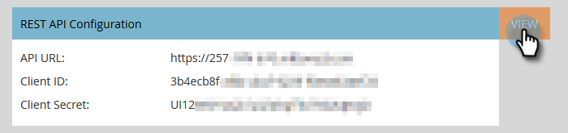
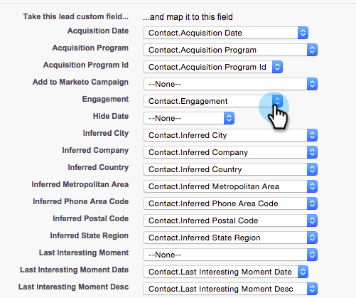

# Configuration de Marketo Sales Insight dans Salesforce Professional Edition {#configure-marketo-sales-insight-in-salesforce-professional-edition}

Configurez Marketo Sales Insight dans Salesforce Professional Edition en procédant comme suit.

>[!PREREQUISITES]
>
>* Installez Marketo dans votre Salesforce Professional Edition.
>
>* [Installation du package Marketo Sales Insight dans l’AppExchange Salesforce](/help/marketo/product-docs/marketo-sales-insight/msi-for-salesforce/installation/install-marketo-sales-insight-package-in-salesforce-appexchange.md){target="_blank"}

>[!NOTE]
>
>**Des autorisations d’administrateur sont requises.**

## Configuration de Sales Insight dans Marketo Engage {#configure-sales-insight-in-marketo}

1. Pour obtenir les informations d’identification de Marketo Sales Insight à partir de votre compte Marketo, ouvrez une nouvelle fenêtre de navigateur.

1. Accédez au **[!UICONTROL Administration]** zone et sélectionnez **[!UICONTROL Statistiques des ventes]**.

   

1. Cliquez sur **[!UICONTROL Modifier la configuration de l’API]**.

   

1. Saisissez une clé secrète API de votre choix, puis cliquez sur **[!UICONTROL Enregistrer]**. N’utilisez PAS d’esperluette (`&`) dans votre clé secrète API.

   

   >[!NOTE]
   >
   >Votre clé secrète d’API est semblable à un mot de passe pour votre organisation et doit être sécurisée.

1. Pour renseigner les informations d’identification, cliquez sur **[!UICONTROL Affichage]** dans le _[!UICONTROL Configuration de l’API REST]_ du panneau.

   

1. Lorsque la boîte de dialogue de confirmation s’affiche, cliquez sur **[!UICONTROL OK]**.

   

## Configuration de Sales Insight dans Salesforce {#configure-sales-insight-in-salesforce}

1. Dans Salesforce, cliquez sur **[!UICONTROL Configuration]**.

   

1. Recherchez &quot;site distant&quot; et sélectionnez **[!UICONTROL Paramètres du site distant]**.

   

1. Cliquez sur **[!UICONTROL Nouveau site distant]**.

   

1. Entrez le nom du site distant (il peut s’agir d’une `MarketoSoapAPI`). Saisissez l’URL du site distant, qui est votre URL d’hôte Marketo à partir du panneau Configuration de l’API Soap dans Marketo Engage. Cliquez sur **[!UICONTROL Enregistrer]**. Vous avez maintenant créé des paramètres de site distant pour l’API Soap.

   

1. Cliquez sur **[!UICONTROL Nouveau site distant]** encore une fois.

   

1. Saisissez le nom du site distant (il peut s’agir de &quot;MarketoRestAPI&quot;). Saisissez l’URL du site distant, qui correspond à l’URL de votre API dans le panneau Configuration de l’API REST de Marketo. Cliquez sur **[!UICONTROL Enregistrer]**. Vous avez maintenant créé des paramètres de site distant pour l’API REST.

## Octroi aux utilisateurs d’Insight sur les ventes d’un accès aux objets Salesforce standard {#grant-sales-insight-users-profile-access}

En raison des améliorations apportées à la sécurité de Salesforce, les modules d’AppExchange ne peuvent plus accorder d’autorisation aux objets standard, et l’accès doit être accordé aux objets Salesforce appropriés à partir du profil de l’utilisateur Salesforce. Accordez les autorisations requises en procédant comme suit.

1. Cliquez sur **[!UICONTROL Configuration]**.

1. Recherchez &quot;Profils&quot; dans Recherche rapide.

1. Cliquez sur **[!UICONTROL Modifier]** en regard du profil utilisé par vos utilisateurs Salesforce.

1. Dans la section Autorisation d’objet standard , activez l’accès en lecture pour les objets suivants : prospect, contact, compte et opportunité.

1. Cliquez sur **[!UICONTROL Enregistrer]**.

## Personnalisation des dispositions de page {#customize-page-layouts}

1. Cliquez sur **[!UICONTROL Configuration]**.

   

1. Recherchez &quot;mise en page&quot; et sélectionnez l’option **[!UICONTROL Disposition de page]** under **[!UICONTROL Pistes]**.

   

1. Cliquez sur **[!UICONTROL Pages Visualforce]** sur la gauche. Glisser **[!UICONTROL Section]** à la disposition sous la section Liens personnalisés .

   

1. Saisissez &quot;Marketo Sales Insight&quot; comme **[!UICONTROL Nom de la section]**. Sélectionner **[!UICONTROL 1 colonne]** et cliquez sur **[!UICONTROL OK]**.

   

1. Glisser-déposer **prospect** dans la nouvelle section .

   

   >[!TIP]
   >
   >Le nom de cette zone change en fonction du type d’objet. Par exemple, si vous modifiez la mise en page des contacts, l’option Contact s’affiche.

1. Double-cliquez sur le **[!UICONTROL prospect]** que vous venez d&#39;ajouter.

   

1. Modifiez la hauteur à 450 pixels et cliquez sur **[!UICONTROL OK]**.

   

   >[!NOTE]
   >
   >Vérifier **[!UICONTROL Afficher les barres de défilement]** si vous avez besoin d’accéder aux activités de défilement.

   >[!TIP]
   >
   >La hauteur recommandée pour les objets Comptes et opportunités est de 410 pixels.

1. Cliquez sur **[!UICONTROL Champs]** sur la gauche. Recherchez ensuite le composant **[!UICONTROL Engagement]** dans le **[!UICONTROL Marketo Sales Insight]** disposition.

   

1. Répétez l’étape précédente pour les champs suivants :

   * [!UICONTROL Engagement]
   * [!UICONTROL Valeur de score relatif]
   * [!UICONTROL Valeur d’urgence]
   * [!UICONTROL Date du dernier moment intéressant]
   * [!UICONTROL Dernier moment intéressant Desc]
   * [!UICONTROL Dernière source intéressante]
   * [!UICONTROL Dernier type de moment intéressant]

1. Cliquez sur **[!UICONTROL Enregistrer]** lorsque vous avez terminé.

   

1. Pour ajouter des sections de page Visualforce pour **[!UICONTROL Contact]**, **[!UICONTROL Compte]**, et **[!UICONTROL Opportunité]**, répétez les étapes 5 à 7.

1. Répétez les étapes 8 à 10 pour ajouter des champs de statistiques sur les ventes pour **[!UICONTROL Contact]**. Veillez à enregistrer après toute modification.

## Mise en correspondance des champs de personne personnalisés {#map-custom-person-fields}

Les champs de personne Marketo doivent être mappés aux champs de contact Salesforce pour garantir le bon fonctionnement de la conversion. Suivez ces étapes pour les mapper.

1. Cliquez sur **[!UICONTROL Configuration]**.

   

1. Recherchez &quot;champs&quot; dans la barre de recherche, puis cliquez sur **[!UICONTROL Champs]** under **[!UICONTROL Pistes]**.

   

1. Cliquez sur **[!UICONTROL Faire correspondre les champs de piste]**.

   

1. Cliquez sur la liste déroulante à droite pour **[!UICONTROL Engagement]**.

   

1. Sélectionner **[!UICONTROL Contact.Engagement]** dans la liste.

   

1. Répétez et mappez également ces champs.

   | Champ personnalisé de personne Marketo | Champ personnalisé Contact Salesforce |
   |--- |--- |
   | `Engagement` | `Contact.Engagement` |
   | `Relative Score Value` | `Contact.Relative Score Value` |
   | `Urgency Value` | `Contact.Urgency Value` |
   | `Last Interesting Moment Date` | `Contact.Last Interesting Moment Date` |
   | `Last Interesting Moment Desc` | `Contact.Last Interesting Moment Desc` |
   | `Last Interesting Moment Source` | `Contact.Last Interesting Moment Source` |
   | `Last Interesting Moment Type` | `Contact.Last Interesting Moment Type` |

   {style="table-layout:auto"}

1. Lorsque vous avez terminé, cliquez sur **[!UICONTROL Enregistrer]**.

   

## Onglet de configuration de Marketo Sales Insight {#marketo-sales-insight-configuration-tab}

1. Dans Salesforce, cliquez sur le **+** à la fin de la barre d’onglets, puis cliquez sur **[!UICONTROL Configuration de Marketo Sales Insight]**.

1. Copiez les informations d’identification du panneau API Soap dans [Page d’administration de Marketo Sales Insight](/help/marketo/product-docs/marketo-sales-insight/msi-for-salesforce/configuration/configure-marketo-sales-insight-in-salesforce-professional-edition.md#set-up-marketo-sales-insight){target="_blank"} et collez-les dans la section API Soap de la page de configuration Salesforce Sales Insight .

1. Copiez les informations d’identification de la **[!UICONTROL API REST]** dans [Page d’administration de Marketo Sales Insight](/help/marketo/product-docs/marketo-sales-insight/msi-for-salesforce/configuration/configure-marketo-sales-insight-in-salesforce-professional-edition.md#set-up-marketo-sales-insight){target="_blank"} et collez-les dans la section API REST de la page de configuration Salesforce Sales Insight .

   

Vous devriez être en mesure d’afficher les champs Marketo Sales Insight pour les Leads, les contacts, les comptes et les opportunités.

>[!NOTE]
>
>Si le test de diagnostic a échoué, [ajout de champs supplémentaires à la mise en page](https://nation.marketo.com/t5/knowledgebase/how-to-repair-marketo-sales-insight-setup-configuration-problems/ta-p/248218){target="_blank"} peut résoudre le problème.

>[!NOTE]
>
>Pour les comptes, Sales Insight inclut tous les e-mails, mais uniquement les derniers moments intéressants, l’activité web et les changements de score.

>[!MORELIKETHIS]
>
>* [Priorité, urgence, note relative et meilleurs paris](/help/marketo/product-docs/marketo-sales-insight/msi-for-salesforce/features/stars-and-flames/priority-urgency-relative-score-and-best-bets.md){target="_blank"}
>* [Ajouter un onglet Marketo à Salesforce](/help/marketo/product-docs/marketo-sales-insight/msi-for-salesforce/configuration/add-marketo-tab-to-salesforce.md){target="_blank"}
>* [Ajout de l’accès Sales Insight aux profils](/help/marketo/product-docs/marketo-sales-insight/msi-for-salesforce/configuration/add-sales-insight-access-to-profiles.md){target="_blank"}
