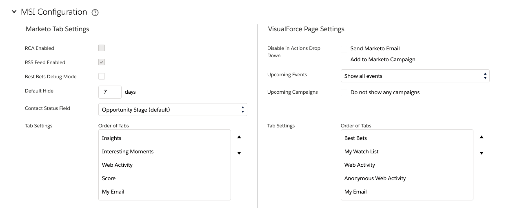

# Onglet de configuration des statistiques de ventes du marketing dans Salesforce {#marketo-sales-insight-configuration-tab-in-salesforce}

## Paramètres opérationnels {#operational-settings}

Vous devez configurer cette configuration pour pouvoir début à l’aide de Sales Insight dans SFDC.

* MSI utilise à la fois Soap et Rest API
* La page Sales Insight de votre compte Marketo comporte deux panneaux correspondants avec les informations d’identification Soap et Rest API que vous pouvez copier et coller ici.
* Les API Soap et Rest comportent des expirations de délai différentes que vous pouvez définir en fonction des besoins de votre entreprise. La durée maximale autorisée est de 120 secondes.
* Désactivation du Tableau de bord Insights : Vous pouvez supprimer les informations d’identification de l’API Rest et utiliser uniquement l’API Soap. Cela désactivera l’onglet Tableau de bord Insights de tous les panneaux MSI de la force visuelle.

## Configuration MSI {#msi-configuration}

Les configurations sont applicables à tous les utilisateurs MSI et ne sont pas spécifiques aux profils.

**Paramètres de l’onglet Marqueur**

* Meilleur mode de débogage des paris
* Masquer par défaut - L&#39;option que vous choisissez ici sera le nombre de jours où un meilleur pari sera masqué dans l&#39;onglet Meilleurs paris du marché lorsque vous cliquez sur l&#39;icône &quot;Masquer&quot;.
* Champ Statut du contact - L&#39;option que vous choisissez ici sera la valeur renseignée dans la colonne En-tête du statut de l&#39;onglet Meilleurs paris du marketing.
* Paramètres d’onglet : les 5 onglets seront disponibles par défaut. Vous pouvez choisir l’ordre des onglets dans la page globale du marketing.

**Paramètres de page Visualforce**

* Activer la liste déroulante Action :

   * Possibilité de masquer l&#39;envoi d&#39;un courrier électronique Marketing dans la liste déroulante Mise en page MSI de piste et de contact
   * Possibilité de masquer les options de Marketo Campaign dans la liste déroulante Mise en page MSI de piste et de contact

* Événements à venir : Possibilité d’afficher les événements invités, tous les événements aux utilisateurs ou de masquer complètement cet onglet
* Campagnes à venir : Possibilité d’afficher toutes les campagnes par courriel ou de masquer complètement cet onglet
* Paramètres d’onglet : les 5 onglets seront disponibles par défaut. Les 5 onglets seront disponibles par défaut. Vous pouvez choisir l&#39;ordre des onglets dans le panneau Sales Insight. La même commande s&#39;applique à toutes les mises en page (piste, contact, compte, opportunité).

**Limites**

* L’Activité (moment intéressant, Activité Web, courriel) est définie sur 1 000 par défaut. Par défaut, les campagnes et Événements par courriel sont définis sur 200
* Si vous constatez des problèmes de délai d’expiration sur votre organisation, vous pouvez réduire la limite

## Réinitialiser l&#39;aperçu commercial de Marketo {#reset-marketo-sales-insight}

Si vous le faites, toutes vos configurations seront effacées dans SFDC et elles ne peuvent pas être restaurées. Vous devrez tout reconfigurer.

