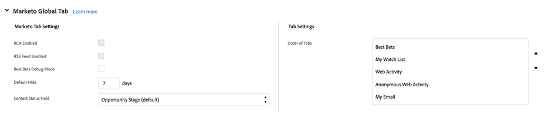

# Onglet de configuration de Marketo Sales Insight dans Salesforce {#marketo-sales-insight-configuration-tab-in-salesforce}

## Paramètres opérationnels {#operational-settings}

Cette configuration est nécessaire pour commencer à utiliser Sales Insight dans SFDC.

* MSI utilise l’API Soap et Rest.
* La page Sales Insight de votre compte Marketo comporte deux panneaux correspondants avec les informations d’identification de l’API Soap et Rest que vous pouvez copier et coller ici.
* Les API Soap et Rest disposent de délais d’attente distincts que vous pouvez définir en fonction des besoins de votre entreprise. La durée maximale autorisée est de 120 secondes.
* Désactivation du tableau de bord des statistiques : vous pouvez supprimer les informations d’identification de l’API REST et utiliser uniquement l’API Soap. Cela désactive l’onglet Tableau de bord des statistiques de tous les panneaux de force visuelle MSI.

## Configuration MSI {#msi-configuration}

Les configurations s’appliquent à tous les utilisateurs MSI et ne sont pas spécifiques aux profils.

**Paramètres de page Visualforce**

* Menu déroulant Activer l’action :
   * Possibilité de masquer le menu déroulant Envoyer le courrier électronique Marketo dans la disposition Lead et Contact MSI
   * Possibilité de masquer les options Ajouter à Marketo Campaign dans la liste déroulante Mise en page MSI de piste et de contact
* Événements à venir : possibilité d’afficher les événements invités, tous les événements pour les utilisateurs ou de masquer complètement cet onglet
* Campagnes à venir : possibilité d’afficher toutes les campagnes par e-mail ou de masquer complètement cet onglet
* Charger les campagnes et événements à venir : capacité de réduire le nombre d’appels d’API REST effectués par les utilisateurs en plaçant l’onglet des événements et campagnes derrière un bouton &quot;Charger les éléments à venir&quot; à la demande
* Paramètres d’onglet : les cinq onglets seront disponibles par défaut. Vous pouvez choisir l’ordre des onglets dans le panneau Sales Insight . La même commande s’applique à toutes les dispositions (prospect, contact, compte, opportunité).

**Onglet global Marketo**

* Flux RSS activé : lorsqu’il est activé, les utilisateurs MSI peuvent afficher leur flux de piste dans un flux RSS (en plus du flux de piste dans Salesforce). Le flux RSS ne peut fonctionner que si la fonction &quot;Expiration du jeton&quot; est désactivée. Ce paramètre est contrôlé dans la page d’administration de Marketo Sales Insight.
* Mode de débogage des meilleurs paris
* Masquage par défaut : l’option que vous choisissez ici est le nombre de jours pendant lesquels un meilleur pari sera masqué dans l’onglet Meilleurs paris de Marketo lorsque vous cliquerez sur l’icône &quot;Masquer&quot;.
* Champ d’état Contact : l’option que vous choisissez ici est la valeur renseignée dans la colonne En-tête d’état de l’onglet Meilleurs paris de Marketo.
* Paramètres du flux en direct : option permettant de choisir d’afficher uniquement le flux en direct (dans les panneaux &quot;prospect&quot;, &quot;contact&quot;, &quot;compte&quot; et &quot;opportunité&quot;, ainsi que sur la page Marketo globale), uniquement le flux en tête (dans la page globale de Marketo) ou le flux en direct et le flux en tête.
* Paramètres d’onglet : les cinq onglets seront disponibles par défaut. Vous pouvez choisir l’ordre des onglets dans la page globale de Marketo.

**Limites**

* Activité (moment intéressant, activité web, courrier électronique) est défini sur 1 000 par défaut. Les campagnes par e-mail et les événements sont définis sur 200 par défaut.
* Si vous constatez des problèmes de délai d’expiration sur votre organisation, vous pouvez réduire cette limite.

**Paramètres d’action**

* Envoyer un courrier électronique Marketo : cette activation permet à tous les utilisateurs de Sales Insight d’envoyer des courriers électroniques à partir des panneaux prospect, contact, compte, opportunité et de l’onglet Meilleurs paris (actions en masse et engagement en ligne).
* Ajouter à Marketo Campaign : l’activation de cette option permet à tous les utilisateurs de Sales Insight d’ajouter des éléments aux campagnes à partir des panneaux &quot;prospect, contact, compte, opportunité&quot; et de l’onglet Meilleurs paris (actions en masse et engagement en ligne).

## Paramètres d’assistance {#support-settings}

Si vous cochez cette case, la journalisation du débogage sera activée dans votre instance Salesforce. Il peut vous aider à résoudre les problèmes.

## Réinitialiser Marketo Sales Insight {#reset-marketo-sales-insight}

Si vous choisissez de le faire, toutes vos configurations seront effacées dans SFDC et elles ne peuvent pas être restaurées. Vous devrez tout reconfigurer.

>[!IMPORTANT]
>
>Ne cochez pas la case &quot;Activer les actions MSI&quot;, sauf si vous utilisez les fonctionnalités d’ actions de statistiques sur les ventes .

>[!MORELIKETHIS]
>
>[Ajout de l’accès Sales Insight aux profils](/help/marketo/product-docs/marketo-sales-insight/msi-for-salesforce/configuration/add-sales-insight-access-to-profiles.md){target="_blank"}
