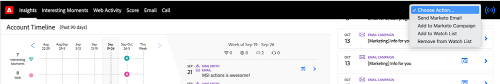
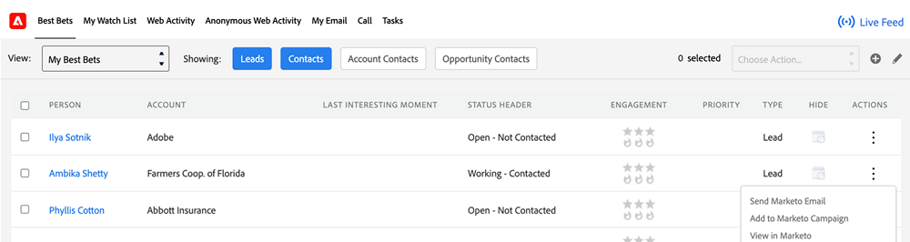

# Choisir une action dans [!DNL Sales Insight] {#choose-an-action-in-sales-insight}

Les actions suivantes sont disponibles à partir de la liste déroulante [!DNL Sales Insight] dans [!DNL Salesforce] Classic et Lightning :

* Envoyer l&#39;e-mail Marketo
* Ajouter à la campagne Marketo
* Ajouter à la liste de surveillance

Chacune de ces fonctionnalités est accessible à partir de :

**Disposition de page avec une seule action**

* Panneau de disposition de lead : action unique et peut être contrôlé par le profil utilisateur
* Panneau de disposition des contacts : une seule action et peut être contrôlée par le profil utilisateur
* Bouton de disposition de lead : une seule action et ne peut pas être contrôlée par le profil utilisateur
* Bouton Contacter la mise en page : une seule action et ne peut pas être contrôlée par le profil utilisateur

  

**Disposition de page avec action de groupe**

* Panneau Disposition du compte : action de groupe et peut être contrôlée par le profil utilisateur
* Panneau Disposition de l’opportunité : action de groupe et peut être contrôlée par le profil utilisateur

  

**[!DNL Best Bets]onglet**

* [!DNL Best Bets] onglet Actions en bloc : action de groupe et peut être contrôlée par le profil utilisateur

  

* [!DNL Best Bets] Onglet Actions en ligne : une seule action et peut être contrôlée par le profil utilisateur

  

**Vue Liste avec action en bloc**

* Vue Liste de leads : action en bloc et ne peut pas être contrôlée par le profil utilisateur
* Vue Liste de contacts : action en bloc et ne peut pas être contrôlée par le profil utilisateur

  
