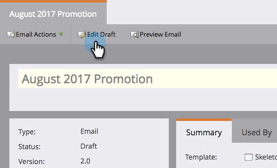

# Verrouiller le modèle de vente {#lock-sales-template}

Pour empêcher les utilisateurs CRM de modifier les modèles de vente, les administrateurs peuvent verrouiller les modèles, ce qui permet aux utilisateurs de verrouiller les modèles individuellement à partir de l’éditeur d’e-mail.

>[!CAUTION]
>
>Cette fonctionnalité fonctionne uniquement pour les [!DNL Salesforce] et n’est pas compatible avec les [!DNL Microsoft Dynamics] ou d’autres CRM. Les modèles accessibles à partir des plug-ins [!DNL Outlook] ou Gmail ne seront pas verrouillés, car l’éditeur n’est pas contrôlé par Marketo.

## Activer le modèle de verrouillage {#enable-lock-template}

>[!NOTE]
>
>**Autorisations d’administrateur requises**

1. Accédez à **[!UICONTROL Admin]**, puis cliquez sur **[!UICONTROL Insight commerciale]**.

   

1. Sous **[!UICONTROL Paramètres]**, cliquez sur **[!UICONTROL Modifier]**.

   

1. Cochez **[!UICONTROL Activer la possibilité de verrouiller des modèles]**. Cliquez sur **[!UICONTROL Enregistrer]**.

   

>[!NOTE]
>
>Par défaut, cette case est cochée et la possibilité de verrouiller des modèles est activée. Si vous la décochez, la fonction de verrouillage du modèle sera désactivée dans l’éditeur d’e-mail.

>[!NOTE]
>
>La modification de ce paramètre en tant qu’administrateur n’affecte **rétroactivement** modèles existants ; en d’autres termes, il ne les verrouille pas automatiquement.

## Verrouiller le modèle dans l’éditeur d’e-mail {#lock-template-in-the-email-editor}

1. Sélectionnez l’e-mail à verrouiller, puis cliquez sur **[!UICONTROL Modifier le brouillon]**.

   

1. Dans l’éditeur d’e-mail, cliquez sur **[!UICONTROL Paramètres de messagerie]**.

   

1. Cochez **[!UICONTROL Publier sur Marketo Sales Insight]** si ce n’est pas déjà fait. Vous pouvez désormais décocher **[!UICONTROL Autoriser l’utilisateur CRM à modifier l’e-mail]** afin de verrouiller le modèle. Cliquez sur **[!UICONTROL Enregistrer]**.

   

   >[!NOTE]
   >
   >Par défaut, cette case est cochée et les utilisateurs CRM sont autorisés à modifier les e-mails.
