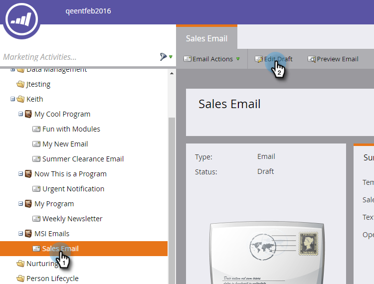

# Publier un courriel dans Sales Insight {#publish-an-email-to-sales-insight}

Activez le paramètre Publier sur les statistiques des ventes pour mettre un courriel à la disposition de votre équipe commerciale à la fois dans les statistiques des ventes et dans l&#39;Ajoute Outlook et Gmail. Vous pouvez également lui indiquer une date d’expiration.

1. Recherchez votre adresse électronique, sélectionnez-la et cliquez sur **Modifier le brouillon**.

   

1. Une fois l’éditeur ouvert, cliquez sur Paramètres **du** courrier électronique.

   

1. Cochez la case **Publier sur les statistiques** de ventes marketing.

   

1. Pour définir une date d’expiration (facultative), cochez la case **Définir l’expiration** et choisissez une date.

   

   >[!NOTE]
   >
   >À 23:59 (CST) à la date d&#39;expiration (si vous en définissez une), le courrier électronique que vous avez mis à disposition disparaîtra de Sales Insight ainsi que de tous ses compléments. Il sera bien sûr toujours accessible à Marketo.

1. Cliquez sur **Enregistrer**.

   

Beau boulot ! Vous savez maintenant comment rendre les courriers électroniques disponibles pour l&#39;équipe commerciale à envoyer du côté CRM, et limiter leur temps disponible, si nécessaire.

>[!NOTE]
>
>[Mes jetons](../../../../../../product-docs/core-marketo-concepts/programs/tokens/understanding-my-tokens-in-a-program.md) ne seront pas résolus lors de l&#39;envoi d&#39;un courrier électronique à partir de Sales Insight sur Microsoft Dynamics ou Salesforce ; seuls les jetons standard sont renseignés (piste, Société, etc.). Les valeurs par défaut des jetons fonctionneront toutefois.

>[!TIP]
>
>N&#39;oubliez pas d&#39;approuver ce courriel pour que les modifications prennent effet. Découvrez comment [approuver un courriel](../../../../../../product-docs/email-marketing/general/creating-an-email/approve-an-email.md).

