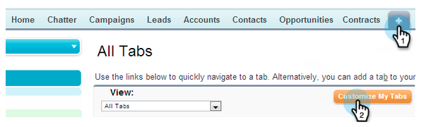

# Ajouter l&#39;onglet et les boutons d&#39;aperçu commercial du marketing à Salesforce {#add-marketo-sales-insight-tab-and-buttons-to-salesforce}

Vous pouvez ajouter à votre vue Salesforce des boutons et des onglets personnalisés Marketing Insight Sales pour un accès facile. Intéressé ? Voici comment.

## Ajouter l’onglet Marketo  {#adding-the-marketo-tab}

1. Cliquez sur** + **et sur **Personnaliser mes onglets**.

   

1. Sélectionnez Marketo dans la liste de gauche. Cliquez ensuite sur **Ajouter** pour l’ajouter aux onglets **** sélectionnés.

   >[!TIP]
   >
   >Utilisez les flèches **Haut** et **Bas** pour réorganiser vos onglets.

   

   Et voici votre onglet Marketo !

   

## Ajouter des boutons marketing {#adding-marketo-buttons}

Vous pouvez ajouter des boutons Marketo à vos mises en page Salesforce. Voici un exemple :

1. Cliquez sur **Configuration**. Recherchez &quot;mise en page de la recherche&quot; et cliquez sur **Rechercher dans les mises en page** sous **Pistes**.

   

1. Cliquez sur **Modifier** dans la ligne **Leads Liste Vue **row.

   

1. Ajoutez **Ajouter à Marketo Campaign**, **Envoyer un e-mail** Marketo et **Ajouter à surveiller les boutons de Liste** sur les boutons **sélectionnés et Enregistrer.******

   

   >[!TIP]
   >
   >Maintenez la touche Maj enfoncée pour sélectionner les trois boutons en même temps.

1. Répétez ces étapes pour vos Contacts (les trois boutons) et Comptes (un seul bouton : Ajouter de surveiller la Liste).

   >[!NOTE]
   >
   >Vous ne pouvez pas ajouter de boutons marketing aux opportunités.

Super boulot !
