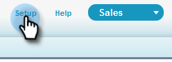

# Configuration pour les clients existants {#configuration-for-existing-customers}

Configurez la configuration suivante afin de commencer à utiliser le nouveau Tableau de bord Insights.

>[!PREREQUISITES]
>
>Assurez-vous d&#39;avoir mis à niveau votre package Salesforce vers la dernière version

## Configurer Sales Insight dans Marketo {#configure-sales-insight-in-marketo}

1. Ouvrez un nouvel onglet dans votre navigateur pour obtenir les informations d’identification des statistiques de ventes du marketing à partir de votre compte Marketo.
1. Accédez à la zone **Admin** .

   

1. Cliquez sur **Sales Insight**.

   

1. Cliquez sur **Vue** pour renseigner les informations d’identification de l’API REST.

   

1. Vous verrez une fenêtre contextuelle de confirmation. Cliquez sur **OK**.

## Configurer Sales Insight dans Salesforce {#configure-sales-insight-in-salesforce}

1. Dans Salesforce, cliquez sur **Configuration**.

   

1. Recherchez et sélectionnez Paramètres **du site** distant.

   

1. Cliquez sur **Nouveau site** distant.

   

1. Saisissez le nom du site distant (il peut s’agir de &quot;MarketoRestAPI&quot;) et l’URL du site distant (l’URL de votre API du panneau Configuration de l’API REST dans Marketo).

   

1. Cliquez sur **Enregistrer**.

   

   Vous avez maintenant créé un paramètre de site distant pour l’API REST.

## Accéder à Marketo Sales Insight {#access-marketo-sales-insight}

1. Copiez les informations d’identification du panneau API REST dans la page d’administration de Sales Insight de Marketo. Collez-les dans la section API REST de la page de configuration de Sales Insight de Salesforce.
1. Entrez la clé secrète de l&#39;API.

   

