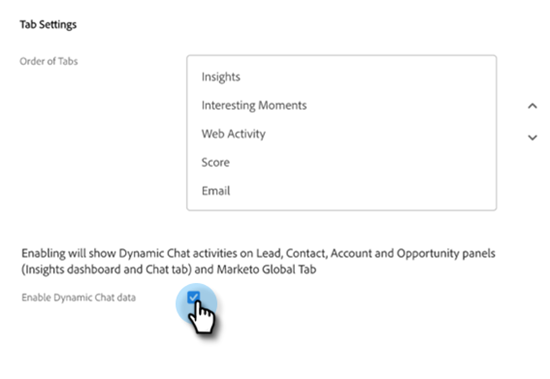

# Intégration de tchat dynamique {#dynamic-chat-integration}

En savoir plus sur l’intégration du Dynamic Chat à Sales Insight.

>[!PREREQUISITES]
>
>* Votre package SFDC Sales Insight doit être une version [1.9 ou version ultérieure](/help/marketo/product-docs/marketo-sales-insight/msi-for-salesforce/upgrading/upgrading-your-msi-package.md){target="_blank"}
>
>* Vous devez avoir la variable [Intégration de Dynamic Chat](/help/marketo/product-docs/demand-generation/dynamic-chat/dynamic-chat-overview.md){target="_blank"} configurer

## Onglet Configuration des statistiques sur les ventes Marketo {#marketo-sales-insight-configuration-tab}

Suivez les étapes ci-dessous pour activer l’intégration du Dynamic Chat.

1. Connectez-vous à votre compte Salesforce, cliquez sur le signe + à la fin de la barre d’onglets, puis cliquez sur **Configuration de Marketo Sales Insight**.

1. Cliquez sur pour développer le &quot;panneau Visualforce&quot;.

   

1. Sélectionnez la **Activation des données de Dynamic Chat** .

   

## Présentation des fonctionnalités {#feature-overview}

Les activités de Dynamic Chat suivantes peuvent être exploitées par les utilisateurs de Sales Insight..

Dialogue engagé : Connecté à Marketo et renseigné dans Sales Insight lorsqu’un visiteur clique sur un chatterbot et engage le dialogue.

* Nom de la conversation
* URL de la page
* État (initié/abandonné/terminé)

Rendez-vous planifié : Connecté à Marketo et renseigné dans Sales Insight lorsqu’un visiteur parvient à planifier un rendez-vous via le chatbot.

* Nom de la conversation
* Agent
* URL de la page
* Planifié le (ajout d’un horodatage et d’une date)
* État (planifié, replanifié, annulé)

Objectif atteint : Connecté à Marketo et renseigné dans Sales Insight lorsqu’un visiteur atteint un objectif dans un flux de dialogue.

* Nom de la conversation
* Nom de l’objectif
* URL de la page

Interacted with Document : Connecté à Marketo et renseigné dans Sales Insight lorsqu’un visiteur interagit avec un document partagé via le chatterbot.

* Nom de la conversation
* Document
* Statut

Les activités de conversation sont disponibles dans le tableau de bord des connaissances.

Un onglet Conversation est disponible dans les panneaux Prospérité et Contact. Elle comprend les colonnes Type d’activité, Nom de la boîte de dialogue et Date.

Pour en savoir plus sur un type d’activité, cliquez dessus.

De même, les panneaux Compte et Opportunité incluent les colonnes Nom, Type d’activité, Nom de la boîte de dialogue et Date.

L’onglet Conversation est également inclus dans votre onglet Marketo globale. Il comprend trois types d’activité (Dialogue engagé, Rendez-vous planifié, Objectif atteint), ainsi que les colonnes suivantes :

* Individu
* Compte
* Type d’activité (Dialogue engagé, Rendez-vous planifié, Objectif atteint)
* Nom de la conversation
* Date et heure (horodatage)

Encore une fois, vous pouvez en savoir plus sur un type d’activité en cliquant dessus.

>[!NOTE]
>
>Si la case &quot;Activer les données du Dynamic Chat&quot; est désactivée, les fonctionnalités suivantes sont désactivées :
>
>* Rangée avec les activités de conversation dans le tableau de bord des statistiques (grille dynamique et affichage de liste hebdomadaire)
>* Onglet Chat dans les panneaux &quot;Plomb, Contact, Compte et Opportunité&quot;
>* Onglet Conversation dans l’onglet Marketo globale
>
>Il n’est pas possible de désactiver une seule de ces fonctionnalités.

