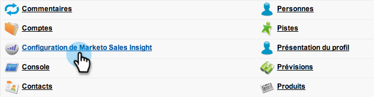

# Préparer Sales Insight for Multi-Lingual Support dans Salesforce {#prepare-sales-insight-for-multi-lingual-support-in-salesforce}

>[!NOTE]
>
>**Autorisations d’administrateur requises**

Les statistiques des ventes de marketing sont stockées par langue. Donc, si vous voulez qu&#39;il fonctionne pour plusieurs langues, vous devez entrer les informations d&#39;identification séparément pour chaque langue.

>[!NOTE]
>
>Sales Insight prend actuellement en charge :
>
>* Anglais
>* Français
>* Allemand

>
>
Toute autre langue prend par défaut l’anglais.

1. Ajouter une nouvelle langue pour Marketing Cloud Sales Insight
1. Connectez-vous à Salesforce. Dans la liste déroulante sous votre nom dans le coin supérieur droit, cliquez sur **Configuration**.

   

1. Sous** Mes renseignements personnels**, cliquez sur Informations **** personnelles.

   

1. Cliquez sur **Modifier**.

   

1. Sélectionnez une langue, puis cliquez sur **Enregistrer**.

   

1. Votre interface Salesforce est maintenant dans la langue sélectionnée. Vous pouvez cliquer sur l’icône **+** pour afficher tous les onglets disponibles.

   

1. Cliquez sur **Configurer les statistiques des ventes du marketing ** (dans la langue sélectionnée).

   

1. Allez sur le marché. Localisez les détails [de la configuration **de votre** API Marketing Insight Sales Insight](https://docs.marketo.com/pages/viewpage.action?pageId=2360368#ConfigureMarketoSalesInsightinSalesforceEnterprise/Unlimited-ConfigureMarketoSalesInsight) .

   

1. Saisissez les détails de l’API dans Marketo et cliquez sur **Enregistrer**.

   

## Remplacer Salesforce par Anglais {#change-salesforce-back-to-english}

Lorsque vous avez fini de personnaliser votre organisation Salesforce, voici comment renvoyer votre configuration personnelle en anglais.

>[!NOTE]
>
>Les captures d&#39;écran suivantes sont en français avec des instructions en anglais.  Vous verrez les mêmes écrans avec du texte dans la langue que vous avez sélectionnée à l’étape précédente.

1. Sous votre nom, cliquez sur Configuration.

1. Cliquez sur Informations **** personnelles sous **Mes informations** personnelles.

   

1. Cliquez sur **Modifier**.

   

1. Sélectionnez **Anglais** dans la liste déroulante Langue, puis cliquez sur **Enregistrer**.

   

   Votre Salesforce est de retour en anglais !

