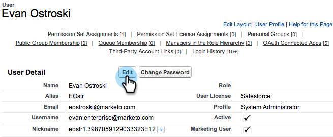

# Préparation de Sales Insight pour la prise en charge multilingue dans Salesforce {#prepare-sales-insight-for-multi-lingual-support-in-salesforce}

>[!NOTE]
>
>**Autorisations d’administrateur requises**

Marketo Sales Insight est stocké par langue. Ainsi, si vous souhaitez qu’il fonctionne pour plusieurs langues, vous devez saisir les informations d’identification séparément pour chaque langue.

>[!NOTE]
>
>[!DNL Sales Insight] prend actuellement en charge :
>
>* Anglais
>* Français
>* Allemand
>
>Toute autre langue est l’anglais par défaut.

## Ajout d’une nouvelle langue pour [!DNL Marketo Sales Insight] {#adding-a-new-language-for-marketo-sales-insight}

1. Connectez-vous à [!DNL Salesforce]. Dans la liste déroulante sous votre nom dans le coin supérieur droit, cliquez sur **[!UICONTROL Configurer]**.

   

1. Sous **[!UICONTROL Mes informations personnelles]**, cliquez sur **[!UICONTROL Informations personnelles]**.

   

1. Cliquez sur **[!UICONTROL Modifier]**.

   

1. Sélectionnez une langue et cliquez sur **[!UICONTROL Enregistrer]**.

   

1. Votre interface [!DNL Salesforce] est maintenant dans la langue sélectionnée. Vous pouvez cliquer sur l’icône **+** pour afficher tous les onglets disponibles.

   

1. Cliquez sur **[!UICONTROL Configurer Marketo Sales Insight]** (dans la langue sélectionnée).

   

1. Accédez à Marketo. Localisez votre [[!DNL Marketo Sales Insight] **[!UICONTROL configuration d’API ]**détails](/help/marketo/product-docs/marketo-sales-insight/msi-for-salesforce/configuration/configure-marketo-sales-insight-in-salesforce-enterprise-unlimited.md#configure-marketo-sales-insight).

   

1. Saisissez les détails de l’API dans Marketo et cliquez sur **[!UICONTROL Enregistrer]**.

   

## Remplacer [!DNL Salesforce] par l’anglais {#change-salesforce-back-to-english}

Une fois la personnalisation de votre organisation [!DNL Salesforce] terminée, voici comment rétablir votre configuration personnelle en anglais.

>[!NOTE]
>
>Les captures d’écran suivantes sont en français et les instructions en anglais.  Les mêmes écrans contenant du texte s’affichent dans la langue sélectionnée à l’étape précédente.

1. Sous votre nom, cliquez sur **[!UICONTROL Configuration]**.

1. Cliquez sur **[!UICONTROL Informations personnelles]** sous **[!UICONTROL Mes informations personnelles]**.

   

1. Cliquez sur **[!UICONTROL Modifier]**.

   

1. Sélectionnez **[!UICONTROL Anglais]** dans le menu déroulant Langue et cliquez sur **[!UICONTROL Enregistrer]**.

   

   Maintenant, votre [!DNL Salesforce] est de retour en anglais !
