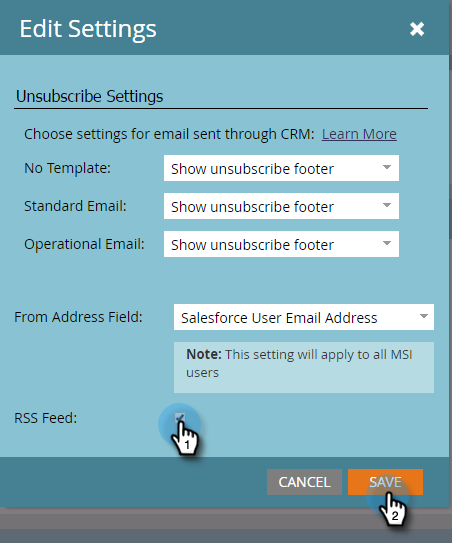

# Activer RSS pour [!DNL Sales Insight] {#enable-rss-for-sales-insight}

>[!NOTE]
>
>**Autorisations d’administration requises**

Si les utilisateurs de Marketo souhaitent afficher leur flux de prospect non seulement dans [!DNL Salesforce], mais également dans un flux RSS, un administrateur Marketo doit d’abord l’activer. C’est très simple.

1. Dans Mon Marketo, cliquez sur **[!UICONTROL Admin]** puis **[!DNL Sales Insight]**.

   

1. Dans Paramètres, cliquez sur **[!UICONTROL Modifier]**. Notez que le flux RSS s&#39;affiche comme **[!UICONTROL Désactivé]**.

   

1. Dans la boîte de dialogue [!UICONTROL Modifier les paramètres], cochez la case **[!UICONTROL Flux RSS]** et cliquez sur **[!UICONTROL Enregistrer]**.

   

   Le flux RSS s’affiche désormais comme **[!UICONTROL Activé]**.

   

   Un morceau de gâteau !
