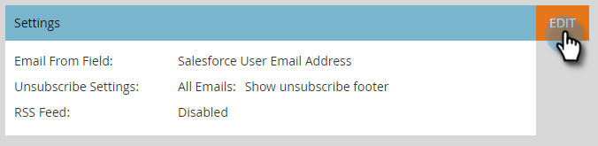

# Activer RSS pour Sales Insight {#enable-rss-for-sales-insight}

>[!NOTE]
>
>**Autorisations d’administrateur requises**

Si les utilisateurs de Marketo souhaitent afficher leur flux prospect non seulement dans Salesforce, mais également dans un flux RSS, un administrateur de Marketo doit l’activer en premier. C&#39;est facile.

1. Dans Mon Marketo, cliquez sur **Administration** puis **Statistiques des ventes**.

   

1. Sur Paramètres, cliquez sur **Modifier**. Notez que le flux RSS s’affiche sous la forme **Désactivé**.

   

1. Dans la boîte de dialogue Modifier les paramètres , cochez la case **flux RSS** , puis cliquez sur **Enregistrer**.

   

   Le flux RSS s’affiche désormais sous la forme **Activé**.

   

   Un morceau de gâteau !
