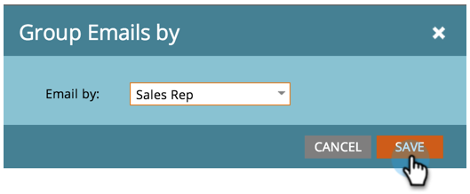

# Rapport Performance des courriers électroniques de Sales Insight {#sales-insight-email-performance-report}

Vue des performances des courriers électroniques envoyés par l&#39;intermédiaire de Salesforce, Microsoft Dynamics ou d&#39;un module externe Gmail ou Outlook.

## Générer un rapport {#generate-a-report}

1. Cliquez sur **Analytics**.

   

1. Cliquez sur **Sales Insight Email Performance**.

   

1. Cliquez sur l’onglet **Configuration** et choisissez les valeurs souhaitées.

   

1. Cliquez sur l’onglet **Rapport** .

   

   Super ! Vous pouvez maintenant voir comment vos courriers électroniques envoyés par votre équipe commerciale ont fonctionné.

   >[!NOTE]
   >
   >L&#39;état Distribué n&#39;est pas capturé pour les courriers électroniques envoyés via Sales Insight et ne sera pas inclus dans ce rapport ou ce journal des activités.

>[!TIP]
>
>Cliquez sur le nom d’un courrier électronique pour l’ouvrir dans l’outil de prévisualisation du courrier électronique.

## Regrouper par représentant commercial {#group-by-sales-rep}

Vous pouvez vue ce rapport groupé par représentant commercial en modifiant vos paramètres.

1. Cliquez sur **Configuration**. Doublon-clic sur **Courriel**.

   

1. Sélectionnez Regrouper les courriers électroniques par représentant **** commercial.

   

1. Cliquez sur **Enregistrer**.

   

1. Cliquez sur l’onglet **Rapport** .

   

   Plutôt cool, hein ? Vous pouvez maintenant voir les performances des courriels regroupés par représentant commercial.

