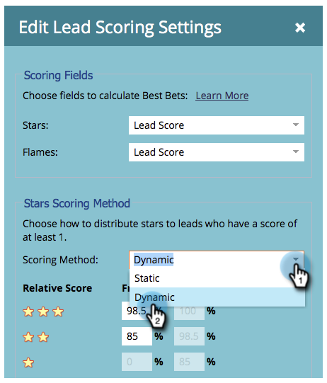

# Personnaliser les étoiles et les flammes {#customize-stars-and-flames}

Marketo Sales Insight utilise des étoiles et des flammes pour classer les pistes par ordre de priorité. Marketo décide automatiquement qui obtient 1-2-3 étoiles/flammes. Vous pouvez toutefois modifier la formule. Voici comment :

>[!AVAILABILITY]
>
>
>Tous les clients n’ont pas acheté cette fonctionnalité. Contactez votre représentant commercial pour plus de détails.

>[!NOTE]
>
>**Autorisations d’administrateur requises**

1. Sous Admin, cliquez sur Sales Insight.

1. Sous la section **Paramètres de score de piste**, cliquez sur **Modifier**.

   

1. Sélectionnez la **méthode de score** de votre choix.

   >[!NOTE]
   >
   >**Définition**
   >
   >
   >**Dynamique**  - Valeur en pourcentage dérivée des données relatives. C&#39;est génial. Cette méthode est recommandée.
   >
   >
   >**Statique**  - Permet de définir des numéros de score exacts - plus de pourcentages, plus de sauces secrètes.

   

1. Modifiez les crochets de pourcentage selon vos préférences et **Enregistrez**.

   >[!TIP]
   >
   >
   >Modifiez simplement le pourcentage de départ, Marketo calculera le pourcentage de fin pour vous !

   

>[!NOTE]
>
>**Rappel**
>
>Une fois les changements effectués, le processus de recalcul des étoiles et des flammes prendra un certain temps. La patience est une vertu.

Chouette ! Vous venez de personnaliser la façon dont Marketo calcule les étoiles et les flammes pour mieux répondre à vos besoins commerciaux.