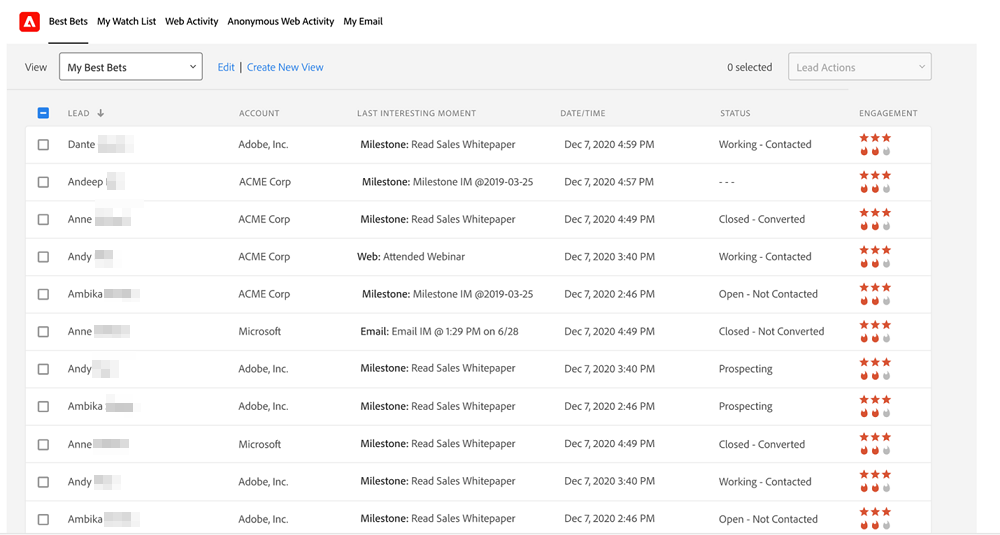

# Priorité, urgence, score relatif et [!DNL Best Bets] {#priority-urgency-relative-score-and-best-bets}

[!DNL Marketo Sales Insight] sélectionne vos meilleurs leads et contacts en fonction de leur priorité. La priorité d’un prospect ou d’un contact comporte deux composants : l’urgence et le score relatif.

Elles sont dérivées du score du prospect, une mesure de l’intérêt de la personne pour vos produits. Plus le score est élevé, plus ils sont susceptibles de répondre positivement à un appel de votre équipe des ventes.

>[!NOTE]
>
>Vous avez besoin de plusieurs campagnes de notation pour obtenir la valeur complète de la priorité, de l’urgence et du score relatif.  Avec trop peu ou pas de campagnes de notation, ces champs ne sont pas utiles.

## Urgence {#urgency}

Les flammes représentent l&#39;urgence — à quel point le score de cette personne a changé récemment. Une urgence élevée (plus de flammes) signifie que le score de ce prospect a augmenté par lots dernièrement ; c&#39;est un bon signe que ce prospect s&#39;intéresse à votre offre. Vous devriez faire un suivi rapide auprès de cette personne !

Par exemple, un prospect qui a demandé une démonstration et visité plusieurs pages web aura probablement un degré d’urgence très élevé. Un prospect qui n’a pas consulté votre page web ou ouvert vos e-mails présente une faible urgence. Utilisez l’urgence pour établir la priorité des personnes à contacter ensuite.

## Évaluation relative {#relative-score}

Les étoiles représentent la note relative, une mesure de la façon dont la note principale de cette personne se compare à celle de tous les autres. Un score relatif élevé signifie que cette personne est probablement plus intéressée et plus informée sur votre offre que les personnes ayant des scores relatifs inférieurs.

Si deux prospects ont la même urgence, vous pouvez utiliser le score relatif pour déterminer lequel mérite un appel téléphonique en premier. Celui qui a le score relatif le plus élevé peut réagir plus favorablement à votre offre par rapport au plus faible.

## [!DNL Best Bets] {#best-bets}

Vos [!DNL Best Bets] sont vos leads et contacts avec la plus haute urgence et le score relatif le plus élevé. Seuls les prospects que vous détenez sont visibles dans cette liste qui est mise à jour à mesure que les scores des prospects changent.

>[!NOTE]
>
>Si vos meilleurs paris ne correspondent pas aux meilleurs leads et contacts que vous possédez, discutez avec une personne de votre société qui a accès à Marketo de la mise à jour de vos [règles de notation](/help/marketo/getting-started/quick-wins/simple-scoring.md).

### Calcul de l’urgence et du score relatif

Pour calculer le nombre d’étoiles et de flammes, vos prospects et contacts sont d’abord triés par score ou changement de score (pour le score relatif et l’urgence, respectivement). Ensuite, ils sont divisés en niveaux — le niveau supérieur reçoit le plus d&#39;étoiles ou de flammes, le suivant en reçoit moins, et ainsi de suite.

À mesure que les scores changent, les valeurs d’urgence, de priorité et de score relatif sont immédiatement recalculées. Les niveaux d’urgence et de score relatif sont automatiquement calculés chaque nuit sur les serveurs Marketo.

>[!NOTE]
>
>Le nombre d’urgences relatives (flammes) et le nombre de scores relatifs (étoiles) sont des entiers dans Marketo. Les valeurs possibles pour chacune sont comprises entre 0 et 3.
