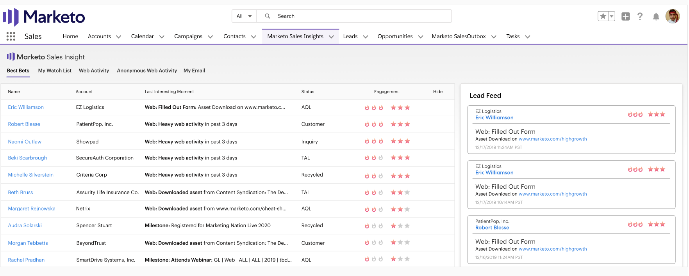

# Priorité, urgence, note relative et meilleurs résultats {#priority-urgency-relative-score-and-best-bets}

Marketo Sales Insight sélectionne vos meilleurs prospects et contacts en fonction de leur priorité. La priorité d&#39;un responsable ou d&#39;un contact comporte deux composantes : urgence et score relatif.

Elles sont dérivées du score de piste — une mesure de l&#39;intérêt de la personne pour vos produits. Plus le score est élevé, plus il est probable qu&#39;ils répondront positivement à un appel de votre équipe commerciale.

>[!NOTE]
>
>Vous avez besoin de plusieurs campagnes de score pour obtenir la valeur complète de priorité, d’urgence et de score relatif.  Avec trop peu ou pas de campagnes de score, ces champs ne seront pas utiles.

## Urgence {#urgency}

Les flammes représentent l&#39;urgence — à quel point le score de cette personne a changé récemment. Une urgence élevée (plus de flammes) signifie que le score de cette piste a augmenté beaucoup ces derniers temps ; c&#39;est un bon signe que cette piste s&#39;intéresse à votre offre. Vous devriez suivre cette personne rapidement !

Par exemple, un responsable qui a demandé une démo et visité plusieurs pages Web aura probablement une très grande urgence. Un prospect qui n’a pas consulté votre page Web ou ouvert vos courriels a une faible urgence. Utilisez l&#39;urgence pour classer par priorité les personnes qui doivent être contactées ensuite.

## Note relative {#relative-score}

Les étoiles représentent un score relatif — une mesure de la façon dont le score de cette personne se compare à celui de tous les autres. Un score relatif élevé signifie que cette personne est probablement plus intéressée et informée de votre offre que les personnes ayant des scores relatifs plus faibles.

Si deux pistes ont la même urgence, vous pouvez utiliser un score relatif pour déterminer laquelle mérite un appel téléphonique en premier. Celui qui a le score relatif le plus élevé peut réagir favorablement à votre offre par rapport à celui qui est le plus faible.

## Meilleurs paris {#best-bets}

Vos meilleurs paris sont vos pistes et contacts avec la plus grande urgence et le score relatif. Seules les pistes que vous possédez sont visibles dans cette liste et la liste est mise à jour à mesure que les scores changent.

>[!NOTE]
>
>Si vos meilleurs paris ne correspondent pas aux meilleurs pistes et contacts que vous détenez, contactez un membre de votre société qui a accès à Marketing pour connaître les mises à jour de vos règles [de](../../../../../getting-started/quick-wins/simple-scoring.md)score.

### Calcul de l’urgence et de la note relative

Pour calculer le nombre d&#39;étoiles et de flammes, vos pistes et contacts sont d&#39;abord triés par score ou changement de score (pour Score relatif et Urgence, respectivement). Ensuite ils sont divisés en niveaux — le niveau supérieur reçoit le plus d&#39;étoiles ou de flammes, le suivant reçoit moins, et ainsi de suite.

À mesure que les scores changent, les valeurs d’urgence, de priorité et de score relatif sont immédiatement recalculées. Les niveaux d&#39;urgence et de score relatif sont automatiquement calculés chaque nuit sur les serveurs Marketo.

>[!NOTE]
>
>Le nombre d’Urgences relatives (flammes) et Score relatif (étoiles) sont des entiers dans Marketo. Les valeurs possibles pour chacun d’eux sont comprises entre 0 et 3.

>[!MORELIKETHIS]
>
>* [Insight commercial du marketing](http://docs.marketo.com/display/docs/marketo+sales+insight)

