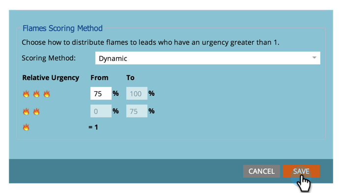

# Définir les champs de score à utiliser pour [!UICONTROL Stars] et [!UICONTROL Flames] dans [!DNL Sales Insight] {#set-score-fields-to-be-used-for-stars-and-flames-in-sales-insight}

>[!NOTE]
>
>**Autorisations d’administration requises**

Par défaut, [!DNL Marketo Sales Insight] utilise le champ **[!UICONTROL Score du lead]** pour calculer les étoiles et les flammes. Mais si vous souhaitez sélectionner un autre champ, procédez comme suit :

>[!TIP]
>
>Si vous ne disposez pas déjà de vos champs de score personnalisés, voici comment les [créer](/help/marketo/product-docs/administration/field-management/create-a-custom-field-in-marketo.md).

>[!NOTE]
>
>**Définition**
>
>* **[!UICONTROL Étoiles]** : les étoiles représentent le score total des prospects par rapport aux autres prospects.
>* **[!UICONTROL Flames]** : les flammes représentent l’urgence - à quel point le score d’un prospect a changé récemment.
>

1. Sous **[!UICONTROL Admin]**, cliquez sur **[!UICONTROL Insight commerciale]**.

   

1. Sous **[!UICONTROL Paramètres de notation des leads]**, cliquez sur **[!UICONTROL Modifier]**.

   

1. Sélectionnez le champ à utiliser pour **[!UICONTROL Étoiles]**.

   

1. Sélectionnez le champ à utiliser pour **[!UICONTROL Flammes]**.

   

1. Cliquez sur **[!UICONTROL Enregistrer]**

   

   >[!NOTE]
   >
   >[!DNL Sales insight] faudra un certain temps pour le recalculer. Vous pouvez vérifier votre CRM plus tard pour voir les étoiles et les flammes.

   >[!MORELIKETHIS]
   >
   >[Priorité, urgence, score relatif et meilleurs résultats](/help/marketo/product-docs/marketo-sales-insight/msi-for-salesforce/features/stars-and-flames/priority-urgency-relative-score-and-best-bets.md)
