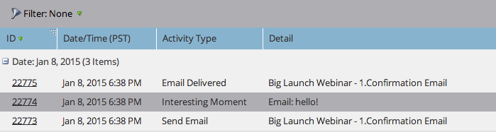

# Utilisation des moments significatifs {#using-interesting-moments}

Les moments intéressants sont la clé pour communiquer avec votre équipe de vente via l&#39;application [!DNL Marketo Sales Insight].

>[!AVAILABILITY]
>
>Ils sont disponibles uniquement pour les clients [!DNL Marketo Sales Insight] et [[!DNL Marketo Sales Connect]](/help/marketo/product-docs/marketo-sales-connect/marketo/interesting-moments-in-sales-connect.md).

## Qu&#39;est-ce qu&#39;un moment intéressant ? {#what-is-an-interesting-moment}

C&#39;est à toi de voir ! Vous décidez quelles informations sont pertinentes pour votre équipe de vente. Votre équipe de vente peut vouloir savoir quand un prospect :

* Visite la page de tarification de votre site web
* Clique sur un lien dans un e-mail d’annonce de nouveau produit.
* Demande une démonstration du produit

## Comment créer un moment intéressant ?  {#how-do-i-create-an-interesting-moment}

1. Choisissez une [campagne intelligente](/help/marketo/product-docs/core-marketo-concepts/smart-campaigns/understanding-smart-campaigns.md), de préférence une campagne que votre équipe de vente trouverait intéressante si elle était déclenchée.

   

1. Faites glisser sur l’étape de flux **[!UICONTROL Moments significatifs]**.

   

1. Sélectionnez un **type** ([!UICONTROL E-mail], [!UICONTROL Jalon] ou [!UICONTROL Web]).

   

1. Dans le champ **[!UICONTROL Description]**, envoyez un message à votre équipe commerciale pour expliquer l’importance de cette action.

   

   >[!NOTE]
   >
   >Marketo ajoutera également la date à laquelle il s’est produit et la manière dont le moment intéressant a été ajouté (c’est-à-dire action de lead > étape de flux, API SOAP).

## Comment cela peut-il devenir encore plus intéressant ?  {#how-can-this-get-even-more-interesting}

Jetons ! Ajoutez-les dans le champ de description pour fournir à votre équipe commerciale des informations plus spécifiques, telles que l’objet de l’e-mail ouvert par le prospect ou la personne qui l’a envoyé. Découvrez les jetons disponibles à utiliser dans le glossaire [Jetons pour les moments significatifs](/help/marketo/product-docs/marketo-sales-insight/msi-for-salesforce/features/tabs-in-the-msi-panel/interesting-moments/trigger-tokens-for-interesting-moments.md).

>[!TIP]
>
>Commencez par cinq moments intéressants, puis travaillez avec votre équipe des ventes pour déterminer les informations qu&#39;elle aimerait voir.

## À quoi ressemble un moment intéressant dans Marketo ?  {#what-does-an-interesting-moment-look-like-in-marketo}

Les moments significatifs seront affichés dans le [journal d’activité du prospect](/help/marketo/product-docs/core-marketo-concepts/smart-lists-and-static-lists/managing-people-in-smart-lists/using-the-person-detail-page.md).

## À quoi ressemble un moment intéressant en [!DNL Salesforce] ?  {#what-does-an-interesting-moment-look-like-in-salesforce}

Une fois que vous avez [installé l [!DNL Marketo Sales Insight] application](/help/marketo/product-docs/marketo-sales-insight/msi-for-salesforce/configuration/configure-marketo-sales-insight-in-salesforce-enterprise-unlimited.md), des moments intéressants s’affichent sur les pages du prospect, du contact, du compte ou de l’opportunité. Ils apparaissent également dans le tableau de bord [!DNL Sales Insight] dans le flux de leads, les [!DNL Best Bets] et la liste de surveillance.

## À quoi ressemble un moment intéressant en [!DNL Salesforce1] ? {#what-does-an-interesting-moment-look-like-in-salesforce-1}

Après avoir installé ou mis à jour [!DNL Marketo Sales Insight] pour [!DNL Salesforce1], des moments intéressants s’affichent sous les liens connexes du prospect.

## S’abonner aux moments significatifs {#subscribe-to-interesting-moments}

Vous pouvez vous abonner à un moment intéressant en cliquant sur le bouton [!UICONTROL S’abonner] dans l’onglet Moment intéressant ou dans le flux de leads. Les étapes ci-dessous sont les mêmes pour les deux.

1. Cliquez sur l’icône S’abonner . Vous accédez alors à l’onglet Abonnement par e-mail .

1. Vous pouvez choisir le type d’alerte par e-mail que vous souhaitez recevoir en fonction de [!UICONTROL Nom], [!UICONTROL Compte], [!UICONTROL Type] ou [!UICONTROL Description].

1. Choisissez la ou les adresses e-mail auxquelles vous souhaitez envoyer les alertes (vous-même/les membres de l’équipe)

1. Cliquez sur **[!UICONTROL S’abonner]**.

>[!NOTE]
>
>Lors de son abonnement aux types ou descriptions de moment intéressant, l’utilisateur recevra des notifications par e-mail de la part des personnes (prospects/contacts) qui lui appartiennent lorsqu’il déclenchera un moment intéressant correspondant à ce type ou à cette description.

