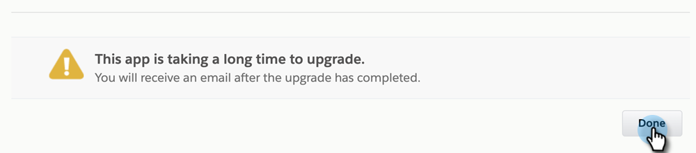
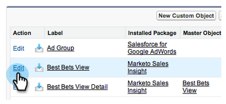

# Installation du package Marketo Sales Insight dans l’AppExchange Salesforce {#install-marketo-sales-insight-package-in-salesforce-appexchange}

Vous devez installer l’application Marketo Sales Insight dans votre abonnement Salesforce avant de pouvoir profiter de tous les avantages de Sales Insight. Voici comment.

>[!NOTE]
>
>**Autorisations d’administrateur requises**

>[!NOTE]
>
>Marketo Sales Insight est compatible avec le chiffrement Salesforce Platform (Shield).

1. Accédez à la [page d’AppExchange pour Marketo Sales Insight](https://appexchange.salesforce.com/listingDetail?listingId=a0N30000001SVZmEAO) et cliquez sur **Obtenir maintenant**.

   

1. Cliquez sur le bouton **Connectez-vous à l’AppExchange** et connectez-vous avec vos informations d’identification Salesforce.

1. Entrez votre compte Salesforce connecté et cliquez sur **Installer en production**.

   

   >[!TIP]
   >
   >Si vous souhaitez d’abord le tester dans votre environnement de test, sélectionnez **Installer dans l’environnement de test**.

1. Lisez et acceptez les conditions générales, puis cliquez sur **Confirmer et installer**.

   

1. Vous pouvez choisir &quot;Installation pour administrateurs uniquement&quot; (et accorder ultérieurement l’accès MSI à des profils spécifiques), &quot;Installation pour tous les utilisateurs&quot; ou &quot;Installation pour des profils spécifiques&quot;.

   

1. Le message suivant peut s’afficher une fois le processus d’installation démarré. Une fois l’installation terminée, vous recevrez un e-mail. Cliquez sur **Terminé** pour ignorer.

   

1. Vérifiez que **Marketo Sales Insight** se trouve dans les packages installés.

   

1. Cliquez sur **Setup** en regard de votre nom.

   

1. Recherchez &quot;objets&quot;, puis cliquez sur **Objets** sous **Créer**.

   

1. Vérifiez deux fois que **Déployé** est coché pour tous les articles Marketo Sales Insight.

   

1. Si un objet n’est pas déployé, cliquez sur **Modifier** en regard de l’élément.

   

1. Sous la section **État de déploiement**, sélectionnez **Déployé**, puis cliquez sur **Enregistrer**.

   

Très bon travail ! Vous avez maintenant installé et déployé Marketo Sales Insight. Allez-y et configurez-le pour votre équipe commerciale et regardez la montée en flèche des ventes.

>[!MORELIKETHIS]
>
>* [Configurer Marketo Sales Insight dans Salesforce Professional Edition](/help/marketo/product-docs/marketo-sales-insight/msi-for-salesforce/configuration/configure-marketo-sales-insight-in-salesforce-professional-edition.md)
>* [Configurer Marketo Sales Insight dans Salesforce Enterprise/Unlimited](/help/marketo/product-docs/marketo-sales-insight/msi-for-salesforce/configuration/configure-marketo-sales-insight-in-salesforce-enterprise-unlimited.md)
>* [Ajout de l’accès Sales Insight aux profils](/help/marketo/product-docs/marketo-sales-insight/msi-for-salesforce/configuration/add-sales-insight-access-to-profiles.md){target="_blank"}
