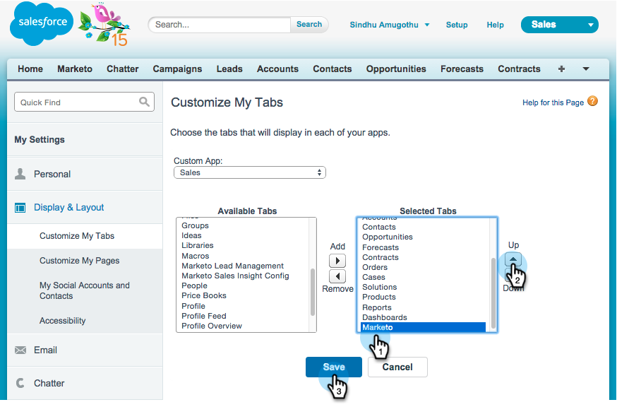

# Installation et configuration de Marketo Sales Insight dans Salesforce1 {#install-and-configure-marketo-sales-insight-in-salesforce}

>[!NOTE]
>
>Clients existants, veuillez [mettre à niveau votre package MSI](/help/marketo/product-docs/marketo-sales-insight/msi-for-salesforce/upgrading/upgrading-your-msi-package.md) avant de continuer !

>[!PREREQUISITES]
>
>Si vous disposez de Salesforce Enterprise/Unlimited :
>
>* [ Étape 1 sur 3 : Ajout de champs Marketo à Salesforce (Enterprise/Unlimited){1](/help/marketo/product-docs/crm-sync/salesforce-sync/setup/enterprise-unlimited-edition/step-1-of-3-add-marketo-fields-to-salesforce-enterprise-unlimited.md)
>* [ Étape 2 sur 3 : création d’un utilisateur Salesforce pour Marketo (Enterprise/Unlimited){1](/help/marketo/product-docs/crm-sync/salesforce-sync/setup/enterprise-unlimited-edition/step-2-of-3-create-a-salesforce-user-for-marketo-enterprise-unlimited.md)
>* [Étape 3 sur 3 : connexion Marketo et Salesforce (Enterprise/Unlimited)](/help/marketo/product-docs/crm-sync/salesforce-sync/setup/enterprise-unlimited-edition/step-3-of-3-connect-marketo-and-salesforce-enterprise-unlimited.md)
>* [Configurer Marketo Sales Insight dans Salesforce Enterprise/Unlimited](/help/marketo/product-docs/marketo-sales-insight/msi-for-salesforce/configuration/configure-marketo-sales-insight-in-salesforce-enterprise-unlimited.md)
>
>Si vous disposez de Salesforce Professional :
>
>* [Configurer Marketo Sales Insight dans Salesforce Professional Edition](/help/marketo/product-docs/marketo-sales-insight/msi-for-salesforce/configuration/configure-marketo-sales-insight-in-salesforce-professional-edition.md)
>

>[!NOTE]
>
>Marketo Sales Insight in Salesforce1 comprend : Bons à parier, Flux de piste, moments intéressants et Ajouter à Marketo Campaign.

## Activation de l’application mobile Salesforce1 {#enable-the-salesforce1-mobile-app}

1. Cliquez sur **Configuration**, puis sur **Administration mobile**.

   

1. Cliquez sur **Salesforce1**.

   

1. Cliquez sur **Paramètres Salesforce1**.

   

1. Cliquez sur **Activer l’application de navigateur mobile Salesforce1**.

   

1. Cliquez sur **Enregistrer**.

   

1. Sélectionnez **Administration mobile**.

   

1. Cliquez sur **Gérer le menu de navigation mobile**.

   

1. Sélectionnez **Marketo** et **ajoutez-le aux options de menu** Selected **.**

   

1. Sélectionnez **Marketo**, déplacez-le **Haut** vers la zone souhaitée, puis cliquez sur **Enregistrer**.

   

## Masquer l’objet personnalisé Marketo obsolète {#hide-outdated-marketo-custom-object}

1. Cliquez sur **Configuration**.

   

1. Sélectionnez **Gérer les utilisateurs**.

   

1. Sélectionnez **Profils**.

   

1. Cliquez pour **modifier** les profils souhaités.

   

1. Sous **Paramètres d&#39;onglet**, sélectionnez le _premier_ **Marketo**.

   

1. Sélectionnez **Onglet masqué**.

   

   >[!NOTE]
   >
   >Veillez à masquer l’onglet Marketo pour tous les profils souhaités.

## Personnalisation des onglets {#customize-tabs}

1. Cliquez sur **+**.

   

1. Cliquez Sur **Personnaliser Mes Onglets**.

   

1. Sélectionnez **Marketo** et **ajoutez-le aux onglets sélectionnés.**

   

1. Sélectionnez **Marketo**, déplacez-le **Haut** vers la zone souhaitée, puis cliquez sur **Enregistrer**.

   

## Personnalisation des mises en page {#customize-page-layouts}

1. Cliquez sur **Configuration**.

   

1. Cliquez sur **Configuration**, saisissez **Mises en page**, puis cliquez sur **Mises en page** sous Pistes.

   >[!NOTE]
   >
   >Répétez les étapes pour chaque mise en page utilisée par votre entreprise (marketing, ventes, etc.). pour les objets Contact, Compte et Opportunité.

   

1. Cliquez sur **Modifier** pour apporter des modifications à la disposition de piste.

   

1. Cliquez sur **Pages Visualforce**, puis faites glisser **Lead Mobile** vers la section Mobile Cards.

   

1. Définissez la Hauteur sur 66 et cliquez sur **OK**.

   

1. Cliquez sur **Champs** et faites glisser **Ajouter à la campagne Marketo** vers la section **Marketo Sales Insight** .

   

   >[!TIP]
   >
   >Saisissez &quot;Ajouter à&quot; dans la recherche rapide pour faciliter la recherche d’Add to Marketo Campaign.

1. Cliquez sur **Enregistrer**.

   

Ouf ! Vous avez enfin terminé d’installer Marketo Sales Insight for Salesforce1 ! Allez-y et donnez-vous une tape sur le dos.

>[!MORELIKETHIS]
>
>* [Meilleurs paris dans Salesforce1](/help/marketo/product-docs/marketo-sales-insight/msi-for-salesforce/msi-for-mobile/best-bets-in-salesforce1.md)
>* [Moments intéressants dans Salesforce1](/help/marketo/product-docs/marketo-sales-insight/msi-for-salesforce/msi-for-mobile/interesting-moments-in-salesforce1.md)
>* [Envoyer un courrier électronique Marketo et des actions Campaign et Watchlist à Salesforce1](/help/marketo/product-docs/marketo-sales-insight/msi-for-salesforce/msi-for-mobile/send-marketo-email-and-campaign-and-watchlist-actions-in-salesforce1.md)
