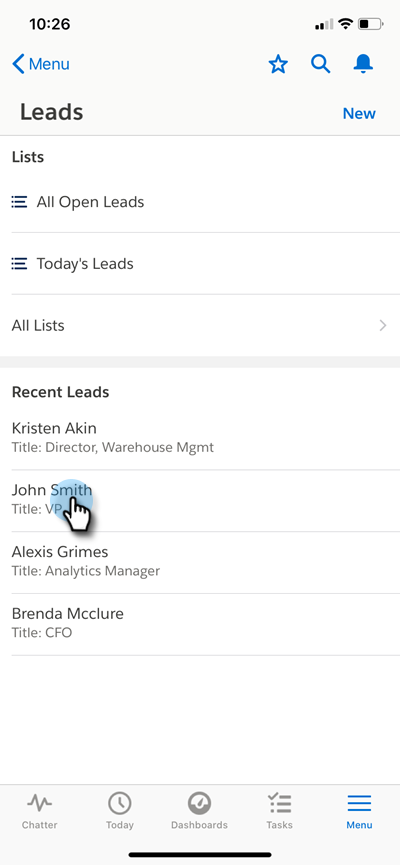

# Moments significatifs de la [!DNL Salesforce1] {#interesting-moments-in-salesforce}

[Utiliser les moments significatifs](/help/marketo/product-docs/marketo-sales-insight/msi-for-salesforce/features/tabs-in-the-msi-panel/interesting-moments/using-interesting-moments.md) est essentiel pour communiquer avec votre équipe commerciale via l’application Marketo Sales Insight. Maintenant, avec [!DNL Marketo Sales Insight] pour [!DNL Salesforce1], vous pouvez faire de même avec votre smartphone !

>[!AVAILABILITY]
>
>Ils sont disponibles uniquement pour les clients [!DNL Marketo Sales Insight].

1. Sur votre smartphone, ouvrez l’application [!DNL Salesforce].

1. Accédez à un prospect.

   

1. Cliquez sur l’onglet **[!UICONTROL Associé]** pour afficher les moments significatifs, l’activité web, l’e-mail et le score.

   

>[!MORELIKETHIS]
>
>* [Moment significatif](/help/marketo/product-docs/core-marketo-concepts/smart-campaigns/flow-actions/interesting-moment.md)
>* [ Jetons pour les moments significatifs ](/help/marketo/product-docs/marketo-sales-insight/msi-for-salesforce/features/tabs-in-the-msi-panel/interesting-moments/trigger-tokens-for-interesting-moments.md)
