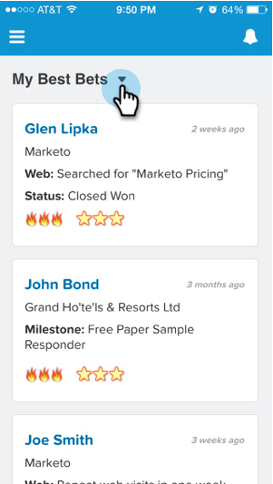

# Affichage du flux de leads dans [!DNL Salesforce1] {#seeing-lead-feed-in-salesforce}

Le flux de leads est une liste à la minute près d’événements intéressants réalisés par vos leads.

1. Accédez à la zone **&#x200B;**&#x200B;dans [!DNL Salesforce1].

   

1. Appuyez sur la flèche vers le bas.

   

1. Appuyez sur **[!UICONTROL Flux de lead]**.

   

   Parfait ! Maintenant, vous savez comment accéder à votre flux de leads !

   

>[!MORELIKETHIS]
>
>* [Moments significatifs dans  [!DNL Salesforce1]](/help/marketo/product-docs/marketo-sales-insight/msi-for-salesforce/msi-for-mobile/interesting-moments-in-salesforce1.md)
>* [Envoi d’e-mails Marketo et actions de campagne et de watchlist dans  [!DNL Salesforce1]](/help/marketo/product-docs/marketo-sales-insight/msi-for-salesforce/msi-for-mobile/send-marketo-email-and-campaign-and-watchlist-actions-in-salesforce1.md)
>* [[!DNL Best Bets] in [!DNL Salesforce1]](/help/marketo/product-docs/marketo-sales-insight/msi-for-salesforce/msi-for-mobile/best-bets-in-salesforce1.md)
