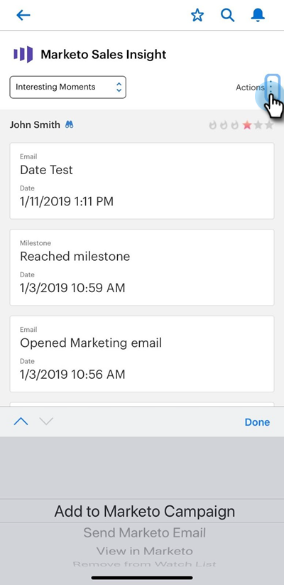

# Envoi d’e-mails Marketo et d’actions de campagne et de watchlist dans [!DNL Salesforce1] {#send-marketo-email-and-campaign-and-watchlist-actions-in-salesforce}

1. Accédez à la zone Détails du lead dans [!DNL Salesforce1] et cliquez sur l’onglet **[!UICONTROL Associé]**.

   

1. Cliquez sur le point (trois petits points). En bas, vous pouvez choisir entre : « [!UICONTROL Ajouter à Marketo Campaign ] », « [!UICONTROL Envoyer un e-mail Marketo ] », « [!UICONTROL Afficher dans Marketo ] », « [!UICONTROL Ajouter à partir de la liste de contrôle ] », « [!UICONTROL Supprimer de la liste de contrôle ] ».

   

   >[!NOTE]
   >
   >Quelles campagnes intelligentes s’affichent ? Ceux avec les déclencheurs « La campagne est demandée ». Découvrez comment configurer une campagne déclenchée [ à l’aide de « La campagne est demandée ](/help/marketo/product-docs/core-marketo-concepts/smart-campaigns/flow-actions/request-campaign.md) ».

Très cool, maintenant vos vendeurs peuvent participer activement à l&#39;effort de marketing.

>[!NOTE]
>
>**Exemple**
>
>Les bonnes campagnes intelligentes à demander peuvent ressembler à celles-ci :
>
>1. Soutien à long terme - quand ils n&#39;ont pas de budget cette année
>1. Cycle de vente actif - lorsque le vendeur ne souhaite envoyer aucun message au prospect, à l&#39;exception du sien (utilisez l&#39;indicateur de suspension marketing pour le désabonner temporairement)
>
>Faites preuve de créativité. Que souhaite automatiser le vendeur ? Demandez-leur et branchez-les !
