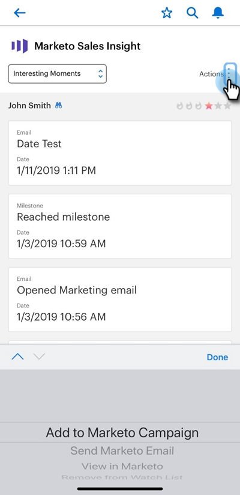

# Envoyer un courrier électronique marketing et des actions Campaign et Watchlist à Salesforce1 {#send-marketo-email-and-campaign-and-watchlist-actions-in-salesforce}

1. Accédez à la zone Détails de piste de Salesforce1 et cliquez sur l&#39;onglet **Associé**.

   

1. Cliquez sur le point (trois petits points). En bas, vous avez le choix entre : &quot;Ajouter à Marketo Campaign&quot;, &quot;Envoyer un courriel marketing&quot;, &quot;Vue dans Marketo&quot;, &quot;Ajouter/Supprimer de la liste de surveillance&quot;.

   

   >[!NOTE]
   >
   >Quelles sont les campagnes intelligentes qui s&#39;affichent ? Ceux qui contiennent &quot;Campaign is Requested&quot; se déclenchent. Découvrez comment configurer une campagne déclenchée [à l&#39;aide de &quot;Campaign is Requested](/help/marketo/product-docs/core-marketo-concepts/smart-campaigns/flow-actions/request-campaign.md)&quot;.

Cool, maintenant vos vendeurs peuvent participer activement à l&#39;effort marketing.

>[!NOTE]
>
>**Exemple**
>
>De bonnes campagnes intelligentes à demander peuvent ressembler à :
>
>1. Entretien à long terme - quand ils n&#39;ont pas de budget cette année
>1. Principal cycle de vente - lorsque le vendeur ne veut pas de messages à l&#39;attention du prospect sauf le sien (utilisez l&#39;indicateur de suspension marketing pour les désabonner temporairement)

>
>
Soyez créatifs ! Qu&#39;est-ce que le vendeur aimerait automatiser ? Demandez-leur et branchez-le !
