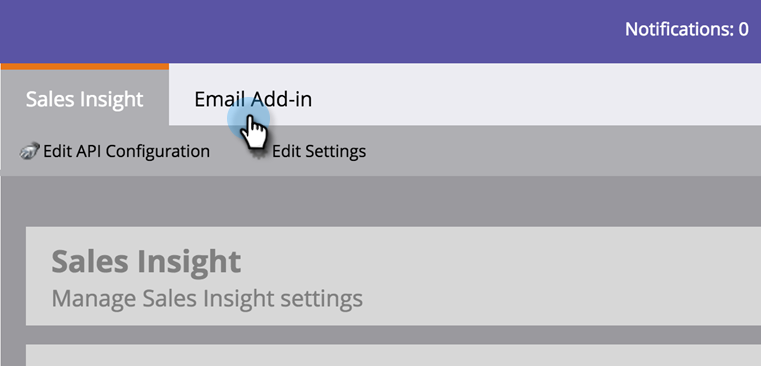

# Installation du complément Marketo pour [!DNL Outlook] avec une clé d&#39;entreprise {#install-the-marketo-add-in-for-outlook-with-an-enterprise-key}

Souvent, les représentants commerciaux ne disposent pas de privilèges d&#39;administration sur leurs ordinateurs portables et leurs équipes informatiques sont chargées d&#39;installer tous les logiciels à distance. Le complément Marketo pour Outlook peut être installé de cette manière à l&#39;aide de votre clé d&#39;entreprise, qui se trouve dans la section Insight des ventes d&#39;Admin. Si vous ne voyez pas le bouton Afficher la clé d&#39;entreprise, contactez le support technique de [Marketo](https://nation.marketo.com/t5/Support/ct-p/Support) pour l&#39;activer.

>[!PREREQUISITES]
>
>L’administrateur doit avoir [émis une licence de complément d’e-mail Marketo](/help/marketo/product-docs/marketo-sales-insight/msi-outlook-plugin/issue-a-marketo-email-add-in-license.md).

>[!NOTE]
>
>Les fonctionnalités Actions de Sales Insight, notamment Envoyer un e-mail de vente, Ajouter à la campagne de vente et Tâches, ne sont pas disponibles dans les plug-ins de messagerie de Sales Insight pour Gmail et Outlook. Actuellement, les utilisateurs ne peuvent envoyer qu’un e-mail trackable avec ou sans modèle d’e-mail Marketo à partir de leur client de messagerie lors de l’utilisation des modules externes d’e-mail Sales Insight.

>[!IMPORTANT]
>
>Microsoft a publié une [nouvelle version d&#39;Outlook pour Windows](https://techcommunity.microsoft.com/t5/outlook-blog/new-outlook-for-windows-now-available/ba-p/3932068){target="_blank"}. Cette nouvelle version ne prend pas en charge le plug-in MSI Outlook existant. Le plug-in MSI Outlook continuera à fonctionner pour les ordinateurs de bureau Windows exécutant la version classique d&#39;Outlook. Pour en savoir plus sur la nouvelle version d&#39;Outlook pour Windows pour les organisations, [cliquez ici](https://techcommunity.microsoft.com/t5/outlook-blog/the-new-outlook-for-windows-for-organization-admins/ba-p/3929169){target="_blank"}.

1. Dans Mon Marketo, cliquez sur **[!UICONTROL Admin]** puis **[!UICONTROL Insight des ventes]**.

   

1. Cliquez sur l’onglet **[!UICONTROL Complément d’e-mail]**.

   

1. Cliquez sur **[!UICONTROL Afficher la clé d’entreprise]**.

   

1. Copiez la clé de licence [!DNL Outlook Enterprise] et collez-la dans un e-mail, avec [ce lien](/help/marketo/product-docs/marketo-sales-insight/msi-outlook-plugin/marketo-outlook-plugin-installation-by-it.md), et envoyez-la à votre service informatique pour installation à distance.

   

   C&#39;est tout ! Ensuite, le commercial passe par le processus d’enregistrement .
