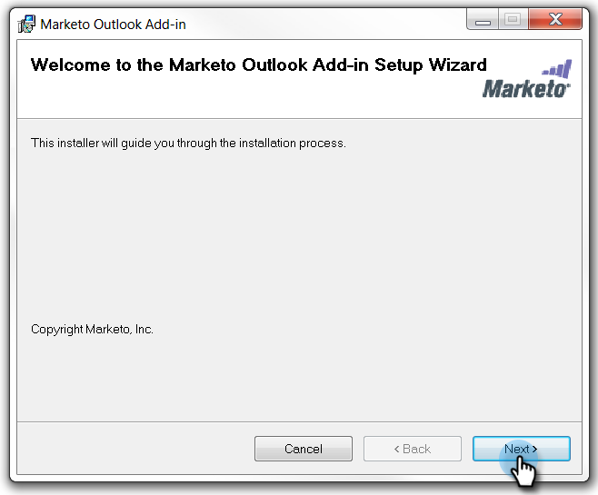

# Installer l&#39;Ajoute de courriel de Marketo pour Outlook avec un code d&#39;inscription {#install-the-marketo-email-add-in-for-outlook-with-a-registration-code}

Si les utilisateurs peuvent accéder aux paramètres d’administration sur leurs ordinateurs portables, vous pouvez leur envoyer directement un code d’enregistrement.

Si vous n’avez pas reçu de courrier électronique d’invitation, demandez à votre administrateur Marketing Cloud de vous inviter.

>[!NOTE]
>
>**Conditions préalables**
>
>* Vous devez [obtenir une licence](issue-a-marketo-email-add-in-license.md)d’Ajoute électronique de Marketing Cloud.

>

## Télécharger le programme d&#39;installation {#download-installer}

1. Identifier votre version [Microsoft Outlook](http://support.office.com/en-us/article/what-version-of-outlook-do-i-have-b3a9568c-edb5-42b9-9825-d48d82b2257c)
1. Cliquez sur le lien pour télécharger le programme d&#39;installation approprié à votre version de Microsoft Outlook.

   >[!NOTE]
   >
   >Les liens ci-dessous ne fonctionnent actuellement que dans Chrome. Désolé pour tout inconvénient.

   | Version d&#39;Outlook | Outlook 32 bits | Outlook 64 bits |
   |---|---|---|
   | Outlook 2000 | Non pris en charge | S/O |
   | Outlook 2003 | [Télécharger](http://munchkin.marketo.net/MarketoAddInSetup32.msi) | S/O |
   | Outlook 2007 | [Télécharger](http://munchkin.marketo.net/MarketoAddInSetup32.msi) | S/O |
   | Outlook 2010 | [Télécharger](http://munchkin.marketo.net/MarketoAddInSetup32.msi) | [Télécharger](http://munchkin.marketo.net/MarketoAddInSetup64.msi) |
   | Outlook 2013 | [Télécharger](http://munchkin.marketo.net/MarketoAddInSetup32.msi) | [Télécharger](http://munchkin.marketo.net/MarketoAddInSetup64.msi) |
   | Outlook 2016 | [Télécharger](http://munchkin.marketo.net/MarketoAddInSetup32.msi) | [Télécharger](http://munchkin.marketo.net/MarketoAddInSetup64.msi) |
   | Outlook 2019 | [Télécharger](http://munchkin.marketo.net/MarketoAddInSetup32.msi) | [Télécharger](http://munchkin.marketo.net/MarketoAddInSetup64.msi) |
   | Outlook O365 (Windows uniquement) | [Télécharger](http://munchkin.marketo.net/MarketoAddInSetup32.msi) | [Télécharger](http://munchkin.marketo.net/MarketoAddInSetup64.msi) |
   | Outlook pour Mac | Non pris en charge | Non pris en charge |
   | Outlook Web App | Non pris en charge | Non pris en charge |

## Copier votre code d’enregistrement {#copy-your-registration-code}

1. Copiez le code d’enregistrement du courrier électronique d’invitation que vous avez reçu.

   

1. Fermez Microsoft Outlook.

   

## Installer {#install}

1. Exécutez le programme d’installation.

   

   >[!NOTE]
   >
   >Si vous recevez un avertissement de sécurité, ne vous inquiétez pas ! Cliquez simplement sur **Exécuter**.

1. Cliquez sur **Suivant**.

   

1. Renseignez les champs **Prénom**, **Nom**, Adresse **de** courriel, puis copiez et collez le **code d’enregistrement **du courrier électronique dans le formulaire et cliquez sur **Suivant.**

   

   >[!TIP]
   >
   >Si l’installation échoue, vérifiez auprès de votre service informatique que le trafic HTTPS n’est pas bloqué. Le programme d’installation nécessite l’ouverture du trafic HTTPS.

1. Cliquez sur** Next** pour effectuer l’installation à l’emplacement par défaut.

   

1. Cliquez sur **Suivant**.

   

   >[!NOTE]
   >
   >Si vous recevez une invite de sécurité concernant un éditeur inconnu, cliquez sur **Oui**.

1. L&#39;installation est maintenant terminée, cliquez sur **Fermer**.

   

1. Ouvrez maintenant Microsoft Outlook et affichez les boutons Marketo.

   

   Excellent ! Les boutons du marché sont désormais mieux placés.

En savoir plus sur l’utilisation des actions Message marketing et Log With Marketo.

>[!NOTE]
>
>**Articles connexes**
>
>* [Envoi et suivi d&#39;un courriel avec l&#39;Ajoute de courriel Marketo pour Outlook](send-and-track-an-email-with-the-email-add-in-for-outlook.md)
>* [Envoi et suivi à partir d&#39;Outlook à l&#39;aide d&#39;un modèle de marketing](send-and-track-from-outlook-using-a-marketo-template.md)

>

