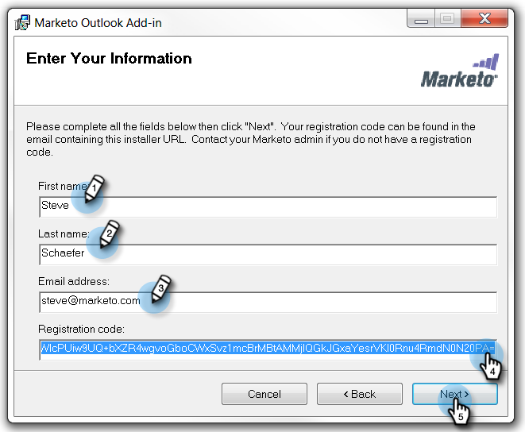

# Installation du module complémentaire de messagerie Marketo pour Outlook avec un code d’enregistrement {#install-the-marketo-email-add-in-for-outlook-with-a-registration-code}

Si les utilisateurs peuvent accéder aux paramètres d’administration sur leurs ordinateurs portables, vous pouvez leur envoyer directement un code d’enregistrement.

Si vous n’avez pas reçu de courrier électronique d’invitation, demandez à votre administrateur Marketo de vous inviter.

>[!PREREQUISITES]
>
>Vous devez [recevoir une licence de module complémentaire de messagerie Marketo](/help/marketo/product-docs/marketo-sales-insight/msi-outlook-plugin/issue-a-marketo-email-add-in-license.md).

>[!IMPORTANT]
>
>L’installation n’est pas prise en charge sur les PC où le dossier des utilisateurs Windows contient des caractères non anglais. Ce dossier est généré automatiquement par Windows sous `<System Root>\Users\` en fonction du nom d’utilisateur Windows et peut contenir des caractères non anglais si le nom d’utilisateur Windows est un nom non anglais. Contactez votre équipe informatique pour vérifier si vous rencontrez des problèmes d’installation.

>[!NOTE]
>
>Les fonctionnalités des actions d’aperçu des ventes, notamment Envoyer un courrier électronique de vente, Ajouter à la campagne de ventes et Tâches, ne sont pas disponibles dans les modules externes de messagerie de Sales Insight pour Gmail et Outlook. Actuellement, les utilisateurs peuvent uniquement envoyer un email pouvant faire l’objet d’un suivi avec ou sans modèle de courrier électronique Marketo depuis leur client de messagerie lors de l’utilisation des modules externes de courrier électronique Sales Insight .

## Télécharger le programme {#download-installer}

1. Identifiez votre [version de Microsoft Outlook](https://support.office.com/en-us/article/what-version-of-outlook-do-i-have-b3a9568c-edb5-42b9-9825-d48d82b2257c){target="_blank"}

1. Cliquez sur le lien pour télécharger le programme d’installation approprié à votre version de Microsoft Outlook.

   >[!NOTE]
   >
   >Actuellement, les liens ci-dessous ne fonctionnent que dans Microsoft Edge ou en cliquant avec le bouton droit de la souris dans Chrome. Désolé pour tout désagrément.

   | Version d’Outlook | Outlook 32 bits | Outlook 64 bits |
   |---|---|---|
   | Outlook 2000 | Non pris en charge | S/O |
   | Outlook 2003 | [Télécharger](https://munchkin.marketo.net/MarketoAddInSetup32.msi) | S/O |
   | Outlook 2007 | [Télécharger](https://munchkin.marketo.net/MarketoAddInSetup32.msi) | S/O |
   | Outlook 2010 | [Télécharger](https://munchkin.marketo.net/MarketoAddInSetup32.msi) | [Télécharger](https://munchkin.marketo.net/MarketoAddInSetup64.msi) |
   | Outlook 2013 | [Télécharger](https://munchkin.marketo.net/MarketoAddInSetup32.msi) | [Télécharger](https://munchkin.marketo.net/MarketoAddInSetup64.msi) |
   | Outlook 2016 | [Télécharger](https://munchkin.marketo.net/MarketoAddInSetup32.msi) | [Télécharger](https://munchkin.marketo.net/MarketoAddInSetup64.msi) |
   | Outlook 2019 | [Télécharger](https://munchkin.marketo.net/MarketoAddInSetup32.msi) | [Télécharger](https://munchkin.marketo.net/MarketoAddInSetup64.msi) |
   | Outlook pour Mac | Non pris en charge | Non pris en charge |
   | Outlook Web App | Non pris en charge | Non pris en charge |
   | Office 365* | [Télécharger](https://munchkin.marketo.net/MarketoAddInSetup32.msi) | [Télécharger](https://munchkin.marketo.net/MarketoAddInSetup64.msi) |

   *Version Office 365 : client Windows uniquement (sous Windows 10, Enterprise ou Pro).

   >[!IMPORTANT]
   >
   >Microsoft a publié une [nouvelle version d’Outlook pour Windows](https://techcommunity.microsoft.com/t5/outlook-blog/new-outlook-for-windows-now-available/ba-p/3932068){target="_blank"}. Cette nouvelle version ne prend pas en charge le module externe MSI Outlook existant. Le module externe MSI Outlook continuera à fonctionner pour les ordinateurs de bureau Windows exécutant la version classique d’Outlook. Pour en savoir plus sur les nouveaux Outlook pour Windows pour les organisations, [cliquez ici](https://techcommunity.microsoft.com/t5/outlook-blog/the-new-outlook-for-windows-for-organization-admins/ba-p/3929169){target="_blank"}.

## Copie de votre code d’enregistrement {#copy-your-registration-code}

1. Copiez le code d’enregistrement du courrier électronique d’invitation que vous avez reçu.

   

1. Fermez Microsoft Outlook.

   

## Installer {#install}

1. Exécutez le programme d’installation.

   

   >[!NOTE]
   >
   >Si vous recevez un avertissement de sécurité, ne vous inquiétez pas ! Cliquez simplement sur **Exécuter**.

1. Cliquez sur **Suivant**.

   

1. Renseignez les champs **Prénom**, **Nom**, **Adresse électronique**, puis copiez et collez le **Code d&#39;enregistrement** de l&#39;email dans le formulaire et cliquez sur **Suivant**.

   

   >[!TIP]
   >
   >Si l’installation échoue, vérifiez auprès de votre service informatique que le trafic HTTPS n’est pas bloqué. Le programme d’installation nécessite l’ouverture du trafic HTTPS.

1. Cliquez sur **Suivant** pour effectuer l’installation à l’emplacement par défaut.

   

1. Cliquez sur **Suivant**.

   

   >[!NOTE]
   >
   >Si vous obtenez une invite de sécurité concernant un éditeur inconnu, cliquez sur **Oui**.

1. L&#39;installation est maintenant terminée, cliquez sur **Fermer**.

   

1. Ouvrez maintenant Microsoft Outlook et affichez les boutons Marketo.

   

   Excellent ! Les boutons de Marketo sont désormais mieux placés.

En savoir plus sur l’utilisation des actions Marketo Message et Log With Marketo .

>[!MORELIKETHIS]
>
>* [Envoi et suivi d’un courrier électronique avec le module complémentaire de messagerie Marketo pour Outlook](/help/marketo/product-docs/marketo-sales-insight/msi-outlook-plugin/send-and-track-an-email-with-the-email-add-in-for-outlook.md){target="_blank"}
>* [Envoi et suivi depuis Outlook à l’aide d’un modèle Marketo](/help/marketo/product-docs/marketo-sales-insight/msi-outlook-plugin/send-and-track-from-outlook-using-a-marketo-template.md){target="_blank"}
