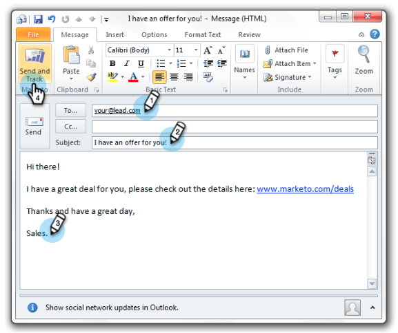

# Envoi et suivi d&#39;un courriel avec l&#39;Ajoute électronique pour Outlook {#send-and-track-an-email-with-the-email-add-in-for-outlook}

Vous pouvez envoyer et suivre des courriers électroniques avec Marketo directement depuis Outlook.

>[!PREREQUISITES]
>
>Si vous ne l&#39;avez pas encore fait, installez le module complémentaire de messagerie [Marketo pour Outlook](install-the-marketo-email-add-in-for-outlook-with-a-registration-code.md).

1. Ouvrez Microsoft Outlook et créez un nouveau courrier électronique.

   

   >[!CAUTION]
   >
   >Si vous incluez plusieurs destinataires dans le courrier électronique, toutes les activités seront suivies sous le premier destinataire.

1. Composez votre courrier électronique comme vous le feriez normalement, puis cliquez sur **Envoyer et effectuer le suivi**.

   

   >[!NOTE]
   >
   >Si vous envoyez un courrier électronique à une personne qui n’existe pas dans votre instance de marketing, un enregistrement de personne est automatiquement créé pour elle. Leur nom de famille sera toujours &quot;mktUnknown&quot; afin que vous puissiez facilement les trouver.

   >[!TIP]
   >
   >Si vous souhaitez utiliser un modèle Marketo, voir [Envoyer et effectuer le suivi à partir d&#39;Outlook à l&#39;aide d&#39;un modèle](send-and-track-from-outlook-using-a-marketo-template.md).

1. Regardez la prévisualisation et cliquez sur **Envoyer**.

   

   >[!CAUTION]
   >
   >La technologie antispam rejette souvent les ouvertures et les clics qui se produisent dans les 20 secondes suivant l&#39;envoi du courrier électronique. Veuillez donc attendre au moins ce temps pour ouvrir/cliquer pendant le test.

   Pour savoir qui a reçu vos courriers électroniques envoyés par Outlook, créez une liste intelligente à l&#39;aide du filtre &quot;Courriel de vente envoyé&quot;.

   

C&#39;est si facile ! Bien que ce courrier électronique ait été envoyé par Outlook d&#39;un vendeur, il sera suivi dans Marketo.

>[!NOTE]
>
>**Articles connexes**
>
>* [Enregistrer le courrier entrant provenant de vos pistes dans Marketo](../../../product-docs/marketo-sales-insight/using-msi/log-inbound-mail-from-your-leads-in-marketo.md)

>

