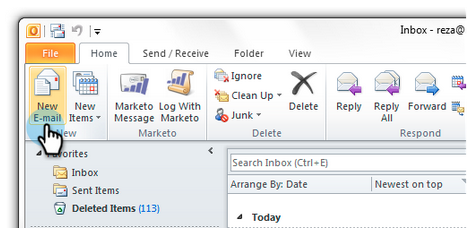

# Envoi et suivi d’un courrier électronique à l’aide du module complémentaire de messagerie pour Outlook {#send-and-track-an-email-with-the-email-add-in-for-outlook}

Vous pouvez envoyer des emails et en effectuer le suivi avec Marketo directement depuis Outlook.

>[!PREREQUISITES]
>
>Si vous ne l’avez pas encore fait, installez le [module complémentaire de messagerie Marketo pour Outlook](/help/marketo/product-docs/marketo-sales-insight/msi-outlook-plugin/install-the-marketo-email-add-in-for-outlook-with-a-registration-code.md).

>[!NOTE]
>
>Les fonctionnalités des actions d’aperçu des ventes, notamment Envoyer un courrier électronique de vente, Ajouter à la campagne de ventes et Tâches, ne sont pas disponibles dans les modules externes de messagerie de Sales Insight pour Gmail et Outlook. Actuellement, les utilisateurs peuvent uniquement envoyer un email pouvant faire l’objet d’un suivi avec ou sans modèle de courrier électronique Marketo depuis leur client de messagerie lors de l’utilisation des modules externes de courrier électronique Sales Insight .

1. Ouvrez Microsoft Outlook et créez un email.

   

   >[!CAUTION]
   >
   >Si vous incluez plusieurs destinataires dans l&#39;email, toutes les activités seront suivies sous le premier destinataire.

1. Composez votre email comme vous le feriez normalement, puis cliquez sur **Envoyer et suivre**.

   

   >[!NOTE]
   >
   >Si vous envoyez un courrier électronique à une personne qui n’existe pas dans votre instance Marketo, un enregistrement de personne sera automatiquement créé pour elle. Leur nom de famille sera toujours &quot;mktUnknown&quot; afin que vous puissiez facilement les trouver.

   >[!TIP]
   >
   >Si vous souhaitez utiliser un modèle Marketo, reportez-vous à la section [Envoi et suivi depuis Outlook à l’aide d’un modèle](/help/marketo/product-docs/marketo-sales-insight/msi-outlook-plugin/send-and-track-from-outlook-using-a-marketo-template.md).

1. Regardez l&#39;aperçu et cliquez sur **Envoyer**.

   

   >[!CAUTION]
   >
   >La technologie anti-spam rejette souvent les ouvertures et les clics qui se produisent dans les 20 secondes suivant l&#39;envoi de l&#39;email. Par conséquent, attendez au moins ce temps avant d&#39;ouvrir/cliquer pendant le test.

   Pour savoir qui a reçu vos emails envoyés par le biais d’Outlook, créez une liste dynamique à l’aide du filtre &quot;A été envoyé par courrier électronique&quot;.

   

C&#39;est si facile ! Même si cet email a été envoyé par Outlook d’un vendeur, il sera suivi dans Marketo.

>[!MORELIKETHIS]
>
>[Log Inbound Mail From Your Leads in Marketo](/help/marketo/product-docs/marketo-sales-insight/using-msi/log-inbound-mail-from-your-leads-in-marketo.md)
