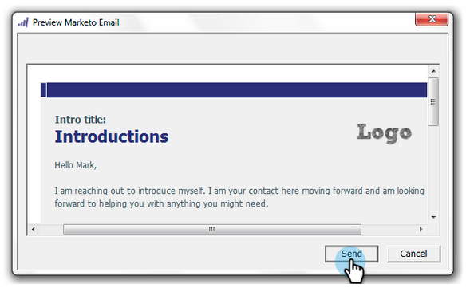

# Envoyer et effectuer un suivi à partir d&#39;Outlook à l&#39;aide d&#39;un modèle de marketing {#send-and-track-from-outlook-using-a-marketo-template}

Si votre équipe marketing vous a mis des modèles à disposition, voici comment vous pouvez les utiliser pour gagner du temps lors de la rédaction de vos courriels.

1. Ouvrez Microsoft Outlook et cliquez sur **Message marketing**.

   

1. Sélectionnez le modèle de votre choix, prévisualisation-le, puis cliquez sur **OK**.

   

1. Effectuez toutes vos modifications, puis cliquez sur **Envoyer et effectuer le suivi**.

   

   >[!NOTE]
   >
   >**Rappel**
   >
   >
   >Les jetons ne sont pas pris en charge avec le complément. Supprimez tout élément qui pourrait se trouver dans le modèle.

1. Consultez la prévisualisation, assurez-vous qu’elle a l’air correcte, puis cliquez sur **Envoyer**.

   

   Et voilà ! Vous avez pu gagner du temps en utilisant des modèles que votre super équipe marketing a fait pour vous.

>[!MORELIKETHIS]
>
>* [Enregistrer le courrier entrant provenant de vos pistes dans Marketo](../../../product-docs/marketo-sales-insight/using-msi/log-inbound-mail-from-your-leads-in-marketo.md)

>

