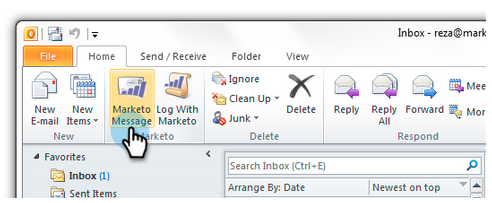
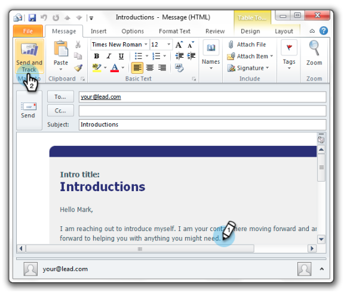

# Envoyer et suivre à partir de [!DNL Outlook] à l’aide d’un modèle Marketo {#send-and-track-from-outlook-using-a-marketo-template}

Si votre équipe marketing a mis des modèles à votre disposition, voici comment les utiliser pour gagner du temps lors de la composition de vos e-mails.

>[!NOTE]
>
>Les fonctionnalités Actions de Sales Insight, notamment Envoyer un e-mail de vente, Ajouter à la campagne de vente et Tâches, ne sont pas disponibles dans les plug-ins de messagerie de Sales Insight pour Gmail et Outlook. Actuellement, les utilisateurs ne peuvent envoyer qu’un e-mail trackable avec ou sans modèle d’e-mail Marketo à partir de leur client de messagerie lors de l’utilisation des modules externes d’e-mail Sales Insight.

1. Ouvrez Microsoft Outlook et cliquez sur **Message Marketo**.

   

1. Sélectionnez le modèle souhaité, affichez-en un aperçu, puis cliquez sur **[!UICONTROL OK]**.

   

1. Apportez toutes vos modifications, puis cliquez sur **[!UICONTROL Envoyer et suivre]**.

   

   >[!NOTE]
   >
   >Les jetons ne sont pas pris en charge avec le complément. Supprimez tout élément susceptible de se trouver dans le modèle.

1. Consultez l’aperçu, vérifiez qu’il s’affiche correctement, puis cliquez sur **[!UICONTROL Envoyer]**.

   

   Et voilà ! Vous avez pu gagner beaucoup de temps en utilisant des modèles créés pour vous par votre super équipe marketing.

>[!MORELIKETHIS]
>
>[Enregistrer le courrier entrant provenant de vos prospects dans Marketo](/help/marketo/product-docs/marketo-sales-insight/using-msi/log-inbound-mail-from-your-leads-in-marketo.md)
