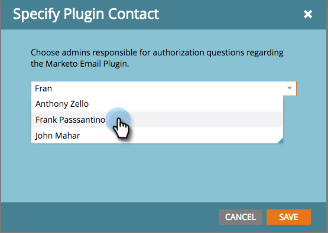

# Spécifier les administrateurs du plug-in Marketo [!UICONTROL Sales Insight] {#specify-marketo-sales-insight-plugin-admins}

Vous pouvez spécifier les contacts qui doivent apparaître dans l&#39;email que vous envoyez aux utilisateurs lorsque vous les invitez à configurer MSI sur [!DNL Outlook].

1. Dans Mon Marketo, cliquez sur **[!UICONTROL Admin]** puis **[!UICONTROL Insight des ventes]**.

   

1. Cliquez sur l’onglet **[!UICONTROL Complément d’e-mail]**.

   

1. Cliquez sur **[!UICONTROL Spécifier le contact du plug-in]**.

   

1. Cliquez pour spécifier les contacts du plug-in.

   

1. Cliquez sur **[!UICONTROL Enregistrer]**

   

1. Les contacts que vous avez sélectionnés seront répertoriés dans les e-mails reçus par les représentants lors du processus d’autorisation.

   

   Parfait !
