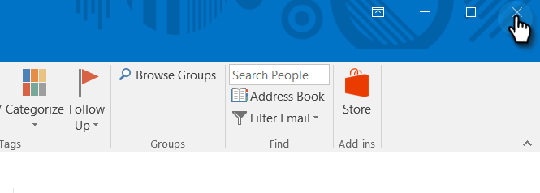

# Mettre à niveau votre complément de messagerie Marketo pour Outlook {#upgrade-your-marketo-email-add-in-for-outlook}

Lorsqu&#39;une nouvelle version du complément de messagerie Marketo pour Outlook est disponible, suivez ces instructions de mise à niveau.

>[!NOTE]
>
>Depuis le 10/1/20, la dernière version du plug-in Outlook ne prend plus en charge le mode hors ligne. Cette opération prend effet après l’installation/la mise à niveau sur ou après 10/1.

## Télécharger le programme d’installation {#download-installer}

Téléchargez le programme d’installation correspondant à votre version de Microsoft Outlook.

<table> 
 <colgroup> 
  <col> 
  <col> 
  <col> 
  <col> 
  <col> 
 </colgroup> 
 <tbody> 
  <tr> 
   <th> </th> 
   <th colspan="2">Installation d’invitations à un utilisateur unique</th> 
   <th colspan="2">Installation de la clé d’entreprise</th> 
  </tr> 
  <tr> 
   <td><strong>Version Outlook</strong></td> 
   <td><strong>32 bits</strong></td> 
   <td><strong>64 bits</strong></td> 
   <td><strong>32 bits</strong></td> 
   <td><strong>64 bits</strong></td> 
  </tr> 
  <tr> 
   <td>Outlook 2000</td> 
   <td>Non pris en charge</td> 
   <td>S/O</td> 
   <td>Non pris en charge</td> 
   <td>S/O</td> 
  </tr> 
  <tr> 
   <td>Outlook 2003</td> 
   <td><a href="https://munchkin.marketo.net/MarketoAddInSetup32.msi" rel="nofollow">Télécharger</a></td> 
   <td>S/O</td> 
   <td>Non pris en charge</td> 
   <td>S/O</td> 
  </tr> 
  <tr> 
   <td>Outlook 2007</td> 
   <td><a href="https://munchkin.marketo.net/MarketoAddInSetup32.msi" rel="nofollow">Télécharger</a></td> 
   <td>S/O</td> 
   <td>Non pris en charge</td> 
   <td>S/O</td> 
  </tr> 
  <tr> 
   <td>Outlook 2010</td> 
   <td><a href="https://munchkin.marketo.net/MarketoAddInSetup32.msi" rel="nofollow">Télécharger</a></td> 
   <td><a href="https://munchkin.marketo.net/MarketoAddInSetup64.msi" rel="nofollow">Télécharger</a></td> 
   <td><a href="https://munchkin.marketo.net/MarketoAddInSetup32.msi" rel="nofollow">Télécharger</a></td> 
   <td><a href="https://munchkin.marketo.net/MarketoAddInSetup64.msi" rel="nofollow">Télécharger</a></td> 
  </tr> 
  <tr> 
   <td>Outlook 2013</td> 
   <td><a href="https://munchkin.marketo.net/MarketoAddInSetup32.msi" rel="nofollow">Télécharger</a></td> 
   <td><a href="https://munchkin.marketo.net/MarketoAddInSetup64.msi" rel="nofollow">Télécharger</a></td> 
   <td><a href="https://munchkin.marketo.net/MarketoAddInSetup32.msi" rel="nofollow">Télécharger</a></td> 
   <td><a href="https://munchkin.marketo.net/MarketoAddInSetup64.msi" rel="nofollow">Télécharger</a></td> 
  </tr> 
  <tr> 
   <td>Outlook 2016</td> 
   <td><a href="https://munchkin.marketo.net/MarketoAddInSetup32.msi" rel="nofollow">Télécharger</a></td> 
   <td><a href="https://munchkin.marketo.net/MarketoAddInSetup64.msi" rel="nofollow">Télécharger</a></td> 
   <td><a href="https://munchkin.marketo.net/MarketoAddInSetup32.msi" rel="nofollow">Télécharger</a></td> 
   <td><a href="https://munchkin.marketo.net/MarketoAddInSetup64.msi" rel="nofollow">Télécharger</a></td> 
  </tr> 
  <tr> 
   <td colspan="1">Outlook 2019</td> 
   <td colspan="1"><a href="https://munchkin.marketo.net/MarketoAddInSetup32.msi" rel="nofollow">Télécharger</a></td> 
   <td colspan="1"><a href="https://munchkin.marketo.net/MarketoAddInSetup64.msi" rel="nofollow">Télécharger</a></td> 
   <td colspan="1"><a href="https://munchkin.marketo.net/MarketoAddInSetup32.msi" rel="nofollow">Télécharger</a></td> 
   <td colspan="1"><a href="https://munchkin.marketo.net/MarketoAddInSetup64.msi" rel="nofollow">Télécharger</a></td> 
  </tr> 
  <tr> 
   <td>Outlook pour Mac</td> 
   <td>Non pris en charge</td> 
   <td>Non pris en charge</td> 
   <td>Non pris en charge</td> 
   <td>Non pris en charge</td> 
  </tr> 
  <tr> 
   <td colspan="1">Outlook Web App</td> 
   <td colspan="1">Non pris en charge</td> 
   <td colspan="1">Non pris en charge</td> 
   <td colspan="1">Non pris en charge</td> 
   <td colspan="1">Non pris en charge</td> 
  </tr> 
  <tr> 
   <td colspan="1">Office 365*</td> 
   <td colspan="1"><a href="https://munchkin.marketo.net/MarketoAddInSetup32.msi" rel="nofollow">Télécharger</a></td> 
   <td colspan="1"><a href="https://munchkin.marketo.net/MarketoAddInSetup64.msi" rel="nofollow">Télécharger</a></td> 
   <td colspan="1"><a href="https://munchkin.marketo.net/MarketoAddInSetup32.msi" rel="nofollow">Télécharger</a></td> 
   <td colspan="1"><a href="https://munchkin.marketo.net/MarketoAddInSetup64.msi" rel="nofollow">Télécharger</a></td> 
  </tr> 
 </tbody> 
</table>

&#42;Version Office 365 : client Windows uniquement (sous Windows 10, Windows 11, Enterprise ou Pro).

## Mise à niveau {#upgrade}

1. Identifiez votre [version Microsoft Outlook](https://support.microsoft.com/en-us/office/what-version-of-outlook-do-i-have-b3a9568c-edb5-42b9-9825-d48d82b2257c?ui=en-us&rs=en-us&ad=us).

1. Sélectionnez votre version dans la liste ci-dessus.

1. Exécutez le programme d’installation.

   

1. Cliquez sur **Suivant**.

   

   >[!NOTE]
   >
   >Dans certains cas, les données seront manquantes. Copiez-le à partir de l&#39;e-mail d&#39;enregistrement, puis fermez Outlook.

1. Fermez Microsoft Outlook.

   

1. Vous remarquerez que toutes vos informations sont préremplies. Cliquez simplement sur **Suivant**.

   

   >[!TIP]
   >
   >Si l’installation échoue, contactez votre service informatique pour vous assurer que le trafic HTTPS n’est pas bloqué. Le programme d’installation nécessite l’ouverture du trafic HTTPS.

1. Cliquez sur **Suivant** pour effectuer l’installation à l’emplacement par défaut.

   

1. Cliquez sur **Suivant**.

   

1. L’installation est maintenant terminée. Cliquez sur **Fermer**.

   

1. Ouvrez maintenant Microsoft Outlook pour afficher la dernière version des boutons Marketo.

   

>[!MORELIKETHIS]
>
>* [Envoyer et suivre un e-mail avec le complément d&#39;e-mail Marketo pour Outlook](/help/marketo/product-docs/marketo-sales-insight/msi-outlook-plugin/send-and-track-an-email-with-the-email-add-in-for-outlook.md)
>* [Envoi et suivi depuis Outlook à l&#39;aide d&#39;un modèle Marketo](/help/marketo/product-docs/marketo-sales-insight/msi-outlook-plugin/send-and-track-from-outlook-using-a-marketo-template.md)
