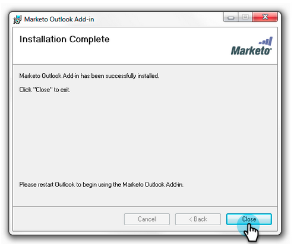

# Mettre à niveau votre Ajoute de courriel Marketing to pour Outlook {#upgrade-your-marketo-email-add-in-for-outlook}

Lorsqu&#39;une nouvelle version de l&#39;Ajoute de courriel de marketing pour Outlook est disponible, suivez ces instructions pour effectuer la mise à niveau.

## Télécharger le programme d&#39;installation {#download-installer}

Téléchargez le programme d&#39;installation approprié à votre version de Microsoft Outlook.

<table> 
 <colgroup> 
  <col> 
  <col> 
  <col> 
  <col> 
  <col> 
 </colgroup> 
 <tbody> 
  <tr> 
   <th> </th> 
   <th colspan="2">Installation d’une invitation à un utilisateur unique</th> 
   <th colspan="2">Installation de clé d’entreprise</th> 
  </tr> 
  <tr> 
   <td><strong>Version d'Outlook</strong></td> 
   <td><strong>32 bits</strong></td> 
   <td><strong>64 bits</strong></td> 
   <td><strong>32 bits</strong></td> 
   <td><strong>64 bits</strong></td> 
  </tr> 
  <tr> 
   <td>Outlook 2000</td> 
   <td>Non pris en charge</td> 
   <td>S/O</td> 
   <td>Non pris en charge</td> 
   <td>S/O</td> 
  </tr> 
  <tr> 
   <td>Outlook 2003</td> 
   <td><a href="http://munchkin.marketo.net/MarketoAddInSetup32.msi" rel="nofollow">Télécharger</a></td> 
   <td>S/O</td> 
   <td>Non pris en charge</td> 
   <td>S/O</td> 
  </tr> 
  <tr> 
   <td>Outlook 2007</td> 
   <td><a href="http://munchkin.marketo.net/MarketoAddInSetup32.msi" rel="nofollow">Télécharger</a></td> 
   <td>S/O</td> 
   <td>Non pris en charge</td> 
   <td>S/O</td> 
  </tr> 
  <tr> 
   <td>Outlook 2010</td> 
   <td><a href="http://munchkin.marketo.net/MarketoAddInSetup32.msi" rel="nofollow">Télécharger</a></td> 
   <td><a href="http://munchkin.marketo.net/MarketoAddInSetup64.msi" rel="nofollow">Télécharger</a></td> 
   <td><a href="http://munchkin.marketo.net/MarketoAddInSetup32.msi" rel="nofollow">Télécharger</a></td> 
   <td><a href="http://munchkin.marketo.net/MarketoAddInSetup64.msi" rel="nofollow">Télécharger</a></td> 
  </tr> 
  <tr> 
   <td>Outlook 2013</td> 
   <td><a href="http://munchkin.marketo.net/MarketoAddInSetup32.msi" rel="nofollow">Télécharger</a></td> 
   <td><a href="http://munchkin.marketo.net/MarketoAddInSetup64.msi" rel="nofollow">Télécharger</a></td> 
   <td><a href="http://munchkin.marketo.net/MarketoAddInSetup32.msi" rel="nofollow">Télécharger</a></td> 
   <td><a href="http://munchkin.marketo.net/MarketoAddInSetup64.msi" rel="nofollow">Télécharger</a></td> 
  </tr> 
  <tr> 
   <td>Outlook 2016</td> 
   <td><a href="http://munchkin.marketo.net/MarketoAddInSetup32.msi" rel="nofollow">Télécharger</a></td> 
   <td><a href="http://munchkin.marketo.net/MarketoAddInSetup64.msi" rel="nofollow">Télécharger</a></td> 
   <td><a href="http://munchkin.marketo.net/MarketoAddInSetup32.msi" rel="nofollow">Télécharger</a></td> 
   <td><a href="http://munchkin.marketo.net/MarketoAddInSetup64.msi" rel="nofollow">Télécharger</a></td> 
  </tr> 
  <tr> 
   <td colspan="1">Outlook 2019</td> 
   <td colspan="1"><a href="http://munchkin.marketo.net/MarketoAddInSetup32.msi" rel="nofollow">Télécharger</a></td> 
   <td colspan="1"><a href="http://munchkin.marketo.net/MarketoAddInSetup64.msi" rel="nofollow">Télécharger</a></td> 
   <td colspan="1"><a href="http://munchkin.marketo.net/MarketoAddInSetup32.msi" rel="nofollow">Télécharger</a></td> 
   <td colspan="1"><a href="http://munchkin.marketo.net/MarketoAddInSetup64.msi" rel="nofollow">Télécharger</a></td> 
  </tr> 
  <tr> 
   <td colspan="1">Outlook O365 (Windows uniquement)</td> 
   <td colspan="1"><a href="http://munchkin.marketo.net/MarketoAddInSetup32.msi" rel="nofollow">Télécharger</a></td> 
   <td colspan="1"><a href="http://munchkin.marketo.net/MarketoAddInSetup64.msi" rel="nofollow">Télécharger</a></td> 
   <td colspan="1"><a href="http://munchkin.marketo.net/MarketoAddInSetup32.msi" rel="nofollow">Télécharger</a></td> 
   <td colspan="1"><a href="http://munchkin.marketo.net/MarketoAddInSetup64.msi" rel="nofollow">Télécharger</a></td> 
  </tr> 
  <tr> 
   <td>Outlook pour Mac</td> 
   <td>Non pris en charge</td> 
   <td>Non pris en charge</td> 
   <td>Non pris en charge</td> 
   <td>Non pris en charge</td> 
  </tr> 
  <tr> 
   <td colspan="1">Outlook Web App</td> 
   <td colspan="1">Non pris en charge</td> 
   <td colspan="1">Non pris en charge</td> 
   <td colspan="1">Non pris en charge</td> 
   <td colspan="1">Non pris en charge</td> 
  </tr> 
 </tbody> 
</table>

## Mise à niveau {#upgrade}

1. Exécutez le programme d’installation.

   

   Cliquez sur Suivant.
   

   >[!NOTE]
   >
   >Dans certains cas, les données manqueront. Copiez-la du courrier électronique d&#39;enregistrement, puis fermez Outlook.

1. Fermez Microsoft Outlook.

   

1. Vous remarquerez que toutes vos informations sont préremplies. Il vous suffit de cliquer sur **Suivant**.

   

   >[!TIP]
   >
   >Si l’installation échoue, demandez à votre service informatique de veiller à ce que le trafic HTTPS ne soit pas bloqué. Le programme d’installation nécessite l’ouverture du trafic HTTPS.

   Cliquez sur Suivant pour effectuer l’installation à l’emplacement par défaut.

   

1. Cliquez sur **Suivant**.

   

1. L&#39;installation est maintenant terminée. Cliquez sur **Fermer**.

   

1. Ouvrez maintenant Microsoft Outlook pour afficher la dernière version des boutons de Marketo.

   

>[!MORELIKETHIS]
>
>* [Envoi et suivi d&#39;un courriel avec l&#39;Ajoute de courriel Marketo pour Outlook](send-and-track-an-email-with-the-email-add-in-for-outlook.md)
>* [Envoi et suivi à partir d&#39;Outlook à l&#39;aide d&#39;un modèle de marketing](send-and-track-from-outlook-using-a-marketo-template.md)

>

