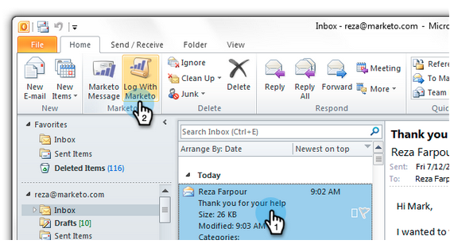

# Enregistrer le courrier entrant provenant de vos pistes dans Marketo {#log-inbound-mail-from-your-leads-in-marketo}

Vous pouvez consigner les réponses de vos pistes directement dans Outlook à l&#39;aide de l&#39;Ajoute de courriel de Marketo.

## A partir de l&#39;application Outlook principale {#from-the-main-outlook-application}

1. Sélectionnez le courrier électronique à enregistrer, puis cliquez sur Log with Marketo (Enregistrer avec Marketo).

>[!TIP]
>
>Vous pouvez également cliquer avec le bouton droit sur un message et cliquer sur **Log With Marketo**.

Vous devriez voir une confirmation.

## À partir du courriel lui-même {#from-the-email-itself}

Si vous avez ouvert le courriel, vous pouvez simplement cliquer sur le bouton Log with Marketo (Enregistrer avec le marketing) à partir de là.

Vous devriez voir la même confirmation que l’autre méthode.

Consignez les réponses de votre prospect pour les ajouter à leur historique dans Marketo.

>[!MORELIKETHIS]
>
>* [Envoi et suivi d&#39;un courriel avec l&#39;Ajoute de courriel Marketo pour Outlook](../../../product-docs/marketo-sales-insight/msi-outlook-plugin/send-and-track-an-email-with-the-email-add-in-for-outlook.md)
>* [Envoi et suivi à partir d&#39;Outlook à l&#39;aide d&#39;un modèle de marketing](../../../product-docs/marketo-sales-insight/msi-outlook-plugin/send-and-track-from-outlook-using-a-marketo-template.md)

>

