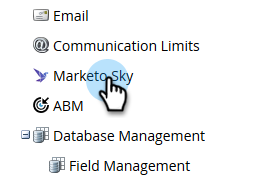

# Activation des rôles pour le Marketo Sky {#enabling-roles-for-marketo-sky}

Pour utiliser le Marketo Sky, les rôles des utilisateurs souhaités doivent être activés.

>[!NOTE]
>
>**Autorisations d’administrateur requises**

1. Dans Marketo Classic, cliquez sur **Admin**.

   

1. Dans l’arborescence, sélectionnez **Marketo Sky**.

   

1. Sélectionnez le ou les rôles souhaités.

   

Les rôles sélectionnés peuvent désormais utiliser le Marketo Sky.
