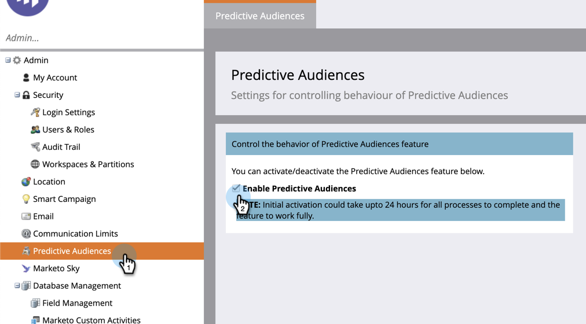

# Prise en main des audiences prédictives {#getting-started-with-predictive-audiences}

Les audiences prédictives (PA) utilisent l’IA et l’apprentissage automatique pour vous permettre de cibler les audiences plus efficacement et de prendre des mesures proactives pour atteindre vos objectifs marketing.

L’application d’une seule page comprend les fonctionnalités suivantes :

* [Suivi des objectifs et enregistrements prévus](/help/marketo/product-docs/marketo-sky/understanding-goal-tracking-and-projected-registrations.md)
* Informations basées sur l’IA/ML
* Valeurs de probabilité d’enregistrement et de présence pour chaque piste d’un programme d’événement
* [Filtres prédictifs](/help/marketo/product-docs/marketo-sky/predictive-filters.md)

Les performances des modèles AI/ML reposent sur les données de votre abonnement. Plus un modèle est utilisé fréquemment, plus il sera adapté à vos données d’abonnement et à votre activité spécifiques.

## Disponibilité {#availability}

Les audiences prédictives sont automatiquement incluses et activées pour les instances utilisant des lots de tarification Prime ou Ultimate. Pour en savoir plus sur l’accès à cette fonctionnalité, contactez votre responsable du succès client.

1. Une fois la fonctionnalité ajoutée à votre instance, accédez à la **[!UICONTROL Audiences prédictives]** dans la **[!UICONTROL Administration]** area of [!DNL Marketo Classic].

1. Vérifier **[!UICONTROL Activation des audiences prédictives]** pour activer la fonction. Notez que la configuration de tous les processus peut prendre jusqu’à 24 heures.

   
