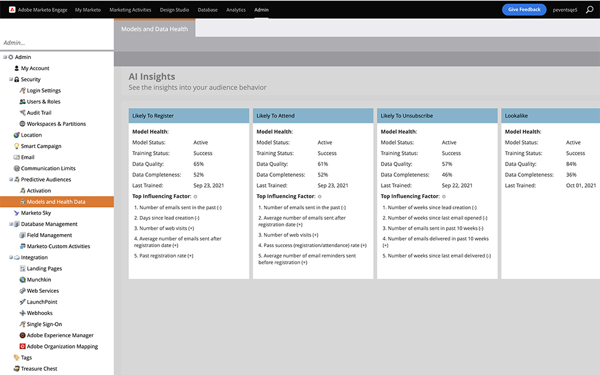

# État et validité des données du modèle {#model-health-and-data-validity}

Les performances de vos modèles dépendent de la qualité et de l’exhaustivité des données d’entrée. Découvrez le facteur d’influence supérieur pour chacun de vos modèles d’IA de probabilité. Voir également les principaux facteurs qui entraînent une inscription plus ou moins importante d’événements, une participation à l’événement ou un désabonnement.

>[!NOTE]
>
>Les comportements marqués par (+) influencent positivement les prédictions (et vice versa).

Voici comment évaluer la santé de votre modèle.

Accédez au **[!UICONTROL Modèles et intégrité des données]** sous **[!UICONTROL Audiences prédictives]** dans le **[!UICONTROL Administration]** de Marketo Classic. Vous y verrez tous vos modèles et leurs statuts.

* **État de l’instruction**: Indique si votre modèle effectue une formation active (amélioration des prédictions). La formation se produit automatiquement toutes les 2 semaines. Tous les modèles qui _Traitement_ peut prendre jusqu’à 24 heures pour finir. Pour tout _En échec_ modèles, veuillez contacter [Prise en charge de Marketo](https://nation.marketo.com/t5/Support/ct-p/Support).
* **État de notation**: Indique si votre modèle calcule activement des prédictions (pourcentages de probabilité) pour les membres du programme.
* **Performances**: catégorisation de l’intégrité de votre modèle en fonction de la complétude des données et de la qualité des données (voir ci-dessous).
* **Complétude des données**: Pourcentage d’attributs de données présents/complets.
* **Qualité des données**: Pourcentage d’attributs contenant de bonnes données utilisables.
