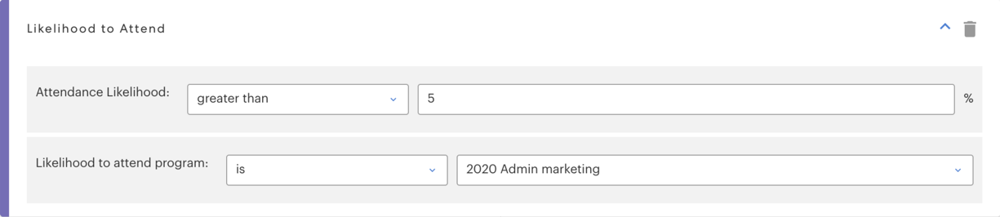

# Filtres prédictifs {#predictive-filters}

Dans le cadre de Predictive Audiences, Marketo propose un groupe de filtres basés sur l’IA/ML dans les listes dynamiques.

>[!NOTE]
>
>Les filtres &quot;Probable de participation&quot; et &quot;Probable d’inscription&quot; ne peuvent être utilisés que dans les programmes Événement ou Email. Il est possible d’utiliser &quot;Probabilité de désabonnement&quot;, &quot;Lookalike of Program Members&quot; et &quot;Lookalike of Smart List Members&quot; dans tous les types de programmes.

## Probabilité de participation

Ce filtre est utilisé pour réduire efficacement votre audience. Cela vous permet de cibler et d’inviter des pistes présentant une probabilité plus élevée de **participant** votre webinaire ou événement. Notez que votre &quot;Probabilité d’assister au programme&quot; sera votre programme d’événements actuel.

## Probabilité d’enregistrement

Semblable au _Probabilité de participation_ filtrer, utiliser ce filtre pour limiter votre audience et cibler les pistes ayant une probabilité plus élevée de **enregistrement** pour votre webinaire ou événement.

## Probabilité de désabonnement

Cela filtre l’audience selon qu’elle a une forte ou une faible probabilité de désabonnement au cours des deux prochaines semaines. Vous pouvez l’utiliser pour cibler les pistes à forte fatigue différemment et plus efficacement. Le seuil de désabonnement est dynamique et piloté par un modèle AI qui prend en compte plusieurs attributs, notamment le temps d’avance dans la base de données et les activités de piste.

>[!NOTE]
>
>Les filtres Probabilité de participation/enregistrement/désabonnement doivent être utilisés conjointement avec d’autres filtres standard.

## Logique des membres de programme/Lookalike des membres de liste dynamique

Ces deux filtres vous aident à développer votre audience actuelle en ciblant des pistes supplémentaires similaires aux membres d’un autre programme ou d’une liste dynamique. Les filtres Lookalike prennent en compte plus de 50 facteurs, notamment les attributs de prospect, l’activité de courrier électronique, l’activité web et l’engagement.

Cliquez sur **[!UICONTROL Ajouter une contrainte]** pour sélectionner des critères de réussite pour les membres du ou des programmes sélectionnés.

Cliquez sur l’icône + en regard du menu déroulant du programme pour ajouter facilement plusieurs programmes/listes dynamiques à un filtre.

