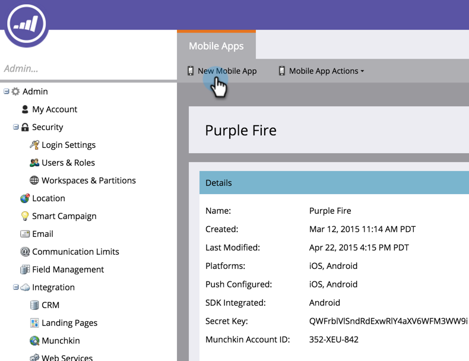

# Ajouter une application mobile {#add-a-mobile-app}

Envoyez des notifications push à votre base de clients en connectant votre application mobile à Marketo.

Les applications démarrent normalement dans un environnement sandbox, où le développement et les tests initiaux sont effectués. Les développeurs utilisent ensuite un environnement de production pour créer l’application finale qui sera utilisée par les clients. Vous devez sélectionner le certificat de notification approprié lors de l’ajout d’une application mobile (voir l’étape 4 ci-dessous).

>[!AVAILABILITY]
>
>
>Tous les utilisateurs de Marketo Engage n’ont pas acheté cette fonctionnalité. Pour plus d’informations, contactez l’équipe du compte Adobe (votre gestionnaire de compte).

1. Cliquez sur **[!UICONTROL Admin]**.

   

1. Cliquez sur **[!UICONTROL Applications et appareils mobiles]**.

   

1. Cliquez sur **[!UICONTROL Nouvelle application mobile]**.

   

1. Saisissez un nom. Dans la liste déroulante **[!UICONTROL Type]**, sélectionnez le type d’environnement utilisé : [!UICONTROL Sandbox] ou [!UICONTROL Production]. Cliquez sur **[!UICONTROL Enregistrer]**

   

   >[!NOTE]
   >
   >Nous vous recommandons d’utiliser un certificat de notification [!UICONTROL Production] dans un environnement [!UICONTROL Production]. Un certificat [!UICONTROL Sandbox] s’installe sans problème dans un environnement de [!UICONTROL Production], mais vous ne recevez pas de notifications. Si vous avez des questions sur votre environnement ou votre certificat de notification, contactez votre administrateur Marketo ou développeur d’applications mobiles.

   Joli ! Configurez maintenant votre application pour qu’elle fonctionne avec les appareils Android et iOS.

>[!MORELIKETHIS]
>
>* [Configuration De L’Accès Push Android Pour Les Applications Mobiles](/help/marketo/product-docs/mobile-marketing/admin/configure-mobile-app-android-push-access.md)
>* [Configuration De L’Accès Push iOS Pour Les Applications Mobiles](/help/marketo/product-docs/mobile-marketing/admin/configure-mobile-app-ios-push-access.md)
